# open-hearts

**A decision engine for the card game Hearts, built to answer one question with evidence: does explicitly reasoning about where the hidden cards are actually make a bot play better?**

Hearts is an imperfect-information game — you never see the other players' hands. This engine maintains an explicit probability distribution over every hidden card's location, updates it from hard deductive evidence (a player who fails to follow suit is *provably* void in that suit), and feeds those beliefs into a search that samples concrete possible hands and plays them out.

Every number below is measured on matched deals with confidence intervals. The experiments that came out negative are published next to the ones that didn't.

**Status:** Phases 1–6 complete: 6A's entropy curve, the C-bench external benchmark, and 6C's exploitability measurement are all closed (6B, the human-data relay, is specified but its build was deferred — see Phase 6 below). Phase 7 in progress — headline so far: **xinxin, the field's reference Hearts bot, built and beaten on the literature's own duplicate protocol** (see the xinxin match section). ~17k lines across engine, inference, search, and evaluation; test suite green in both JIT modes. House rules: no passing round, no shoot-the-moon.

## Results at a glance

Hearts deals 26 points per hand among 4 players, so **6.5 points/hand is symmetric break-even — lower is better.**

| Matchup | Points/hand | Scale |
|---|---|---|
| **vs. xinxin** (Sturtevant's reference Hearts bot, at its literature settings) — paired diff **−0.78 [−0.91, −0.64] in our favor**, Wilcoxon z=−11.3, at ~9× less time per decision | **6.11** (xinxin: 6.89) | 1,000 deals × 14 duplicate seatings = 14,000 games |
| **vs. OpenSpiel's generic ISMCTS baseline** (untuned, random rollouts) — first third-party benchmark | **4.70** (baseline: 7.10) | 1,000 matched deals |
| vs. 3 heuristic opponents — constraint beliefs + honest search | **3.25** [3.07, 3.45] | 500 deals × 4 rotations |
| vs. 3 heuristic opponents — + opponent choice-reading | **2.87** [2.70, 3.04] | 500 deals × 4 rotations |
| vs. 3 held-out synthetic personalities | **2.35** [2.17, 2.52] | 500 deals × 4 rotations |
| *control:* heuristic vs. three copies of itself | 6.50 | break-even alarm |
| *floor:* random legal play | 11.55 | — |
| **Exploitability** — strengthened search attacker vs. the frozen champion | **+0.20** [+0.07, +0.33] extra pts/hand taken (minor leak; hardening not triggered) | 250 deals × 4 rotations |

**Hidden-card inference.** Top-1 accuracy at locating an opponent's card by the last trick, over 2,000 games: **33%** with no information → **48%** from voids alone → **60%** with full constraint propagation → **90%** when opponents' *choices* are also read. That last figure holds only against a known policy and collapses against unfamiliar opponents — quantified in Phase 3 and Phase 5 below, not hidden.

**Engineering.** **20–30× end-to-end speedup** on search games from 52-bit bitboards and numba-compiled kernels, measured JIT-on vs `OPENHEARTS_NO_JIT=1` across matched deals, with pure-Python reference implementations retained and tested. ~0.146s per decision — comparable to the ISMCTS baseline's cost.

## Design decisions that shaped the results

- **The information boundary is architectural, not conventional.** Player code can only ever receive a `PlayerView` — own hand, play history, legal moves. `GameState` has exactly one filtering constructor, so a bot *cannot* see hidden hands even by accident. The classic silent bug of imperfect-information agents is structurally excluded rather than tested for.
- **Every optimization keeps its reference implementation.** Pure-Python versions of every compiled kernel are retained and still tested; `OPENHEARTS_NO_JIT=1` runs them everywhere. Deterministic paths are gated on bitwise-identical output, so speed was never silently traded against correctness.
- **Comparisons are paired on deals and bootstrapped over deals.** Every configuration sees identical cards; each deal is played 4× with the bot rotated through all four seats; confidence intervals resample *deals*, not games, because a deal's four rotations share its luck.
- **Expectations are pre-registered before runs and reported verbatim** — including failures. This caught the project's own wrong baseline in Phase 5, and three separate learned-model approaches were killed and published rather than buried.
- **A break-even alarm runs inside the test suite.** Four identical heuristic players must average 6.5 points/hand; if the evaluation harness ever breaks, that assertion fires before any result is trusted.

Charts referenced throughout are committed in `docs/`. Raw result files land in `results/`, which is gitignored — regenerate them with the commands under [How to run](#how-to-run).

## The one-idea summary

In Hearts, once a player fails to follow suit (say, someone can't follow a club lead), you learn something exact: that player has **zero** clubs. That single fact doesn't just remove clubs from them — because everyone's hand size is fixed, all the probability that clubs *would* have taken up in their hand has to move somewhere else. We keep a running table of "how likely is each opponent to hold each card," update it every time a void is revealed, sample a few concrete hidden-hand guesses from that table, play each one out to the end with simple heuristic players, and choose the move that gives the lowest average points across those playouts.

## How the belief table works

The table is 3 opponents x 52 cards, holding P(opponent i has card c). Two constraints always hold:

- A card the observer can see (in their own hand, or already played) has probability 0 for every opponent.
- Each opponent's row must sum to the number of cards they're still holding.

**A worked example.** You are the observer, and the trigger is a player failing to follow suit. Concretely:

- West leads a heart. North discards a club instead of following. That's a **void reveal**: North has zero hearts.
- Before this: hearts were spread roughly evenly across North, East, and South's remaining hearts (since your own hand and played cards are zeroed out already).
- After this reveal: North's probability on every heart card drops to exactly 0. All of the probability mass that used to sit on "North holds this heart" has to go somewhere, because East and South must still collectively hold every remaining heart. So East's and South's probabilities on those hearts rise.
- But North still holds the same number of cards as before (nothing about her hand *size* changed) — so her probability on her *non-heart* cards has to rise too, to make her row sum back up to her hand size. She still has just as many cards, but now we know none of them are hearts, so the "missing" heart-probability she used to carry gets redistributed onto the clubs, diamonds, and spades she might hold.

This rebalancing — start from raw void/seen-card zeroing, then adjust rows and columns until both constraints (zeroed cells stay zero, each row sums to hand size) hold together — is implemented with iterative proportional fitting in `src/openhearts/belief/table.py`. It is exact for the constraints it's given: it correctly describes what opponents *could* be holding given voids and hand sizes. It says nothing about *how* opponents choose which card to play, which is a real limitation (see below).

There are three levels of belief, compared throughout this README:

- **UNIFORM** — ignore all evidence beyond "cards you can see are zero." Every unseen card equally likely for everyone.
- **VOIDS** — also use void reveals (the mechanism above), rebalanced.
- **FULL** — the full rebalanced table (voids plus proper row/column consistency).

## How to run

```bash
python -m venv .venv
source .venv/bin/activate
pip install -e '.[dev]'
```

Run the fast test suite:

```bash
.venv/bin/python -m pytest -q
```

Run the slow fuzz tests (randomized, more thorough, take longer):

```bash
.venv/bin/python -m pytest -m slow -q
```

Run the experiments (results land in `results/`, which is gitignored — regenerate them rather than expecting them to be checked in):

```bash
python experiments/run_guessing.py          # Question A: are the guesses any good?
python experiments/run_ablation.py          # Question B: do better guesses win more points? (single core)
python experiments/run_ablation_parallel.py # same, but spread across multiple cores
python experiments/run_noleak.py            # corrected control, see "sampler void leak" below
python experiments/run_sampler_stats.py     # how hard the sampler has to work
```

## Headline result 1: can we guess where the cards are?


We compare three belief levels against the true deal (which only the measurement code is allowed to see — the belief code never touches it). By trick 13 (the last trick, when there's the least uncertainty left):

| level   | mean probability on true holder | top-1 accuracy |
|---------|----------------------------------|-----------------|
| FULL    | 0.588                             | 0.60 |
| VOIDS   | 0.483                             | 0.48 |
| UNIFORM | 0.333                             | 0.33 |

At every trick from 1 to 13, FULL >= VOIDS >= UNIFORM. More evidence never hurts, and using void information clearly helps over doing nothing.

**Where we were wrong going in:** the plan guessed FULL would climb close to 1.0 by the last few tricks, since so few cards remain unseen. It doesn't — it plateaus around 0.59. We checked this against exact enumeration of all consistent hands, and 0.59 genuinely is the ceiling for this kind of evidence: in the last few tricks, the cards left in an opponent's hand are frequently *actually interchangeable* given only voids and hand-size constraints — there's no more information to extract from "what suits has this player failed to follow" alone. That ceiling is specific to this evidence class, though: real opponents aren't choosing cards uniformly at random from what's legal, they're playing according to some strategy, and inferring from *how* they play (not just what they're void in) could in principle push accuracy higher. We didn't build that — it's out of scope for this phase — so we can't say how much higher, only that the room for it exists.

## Headline result 2: do better guesses win more points?


Setup: 500 deals, each played with the bot rotated through all 4 seats (2,000 games total), against 3 heuristic opponents. 26 points are dealt per hand, so 6.5 is the break-even point; scoring below 6.5 means beating heuristic opponents.

| config                     | mean  | 95% CI          |
|----------------------------|-------|-----------------|
| search-UNIFORM-n100        | 3.302 | [3.120, 3.485]  |
| search-VOIDS-n100          | 3.139 | [2.964, 3.314]  |
| search-FULL-n100           | 3.267 | [3.091, 3.447]  |
| heuristic (no search)      | 6.500 | (fixed)         |
| random-legal               | 11.548| [11.235, 11.859]|
| search-UNIFORM-noleak-n100 (corrected control) | 3.371 | [3.191, 3.554] |

**The honest reading:**

- Search helps, a lot. Any belief level with sampled-playout search (~3.2–3.4 points/hand) roughly halves the heuristic's score (6.5 points/hand), and the confidence intervals don't overlap. Just *searching* over sampled futures, even with a weak belief model, is clearly worth doing.
- The three belief levels **do not separate statistically** from each other. VOIDS is nominally lowest (3.139) and FULL is nominally worse than VOIDS (3.267), but their confidence intervals overlap heavily with UNIFORM's — we cannot say any belief level beats the others at n=100 samples.
- That's suspicious on its own, though, because even "UNIFORM" here was quietly getting some void information for free: the sampler (`src/openhearts/sampler/sampler.py`) refuses to deal a card into a suit an opponent is known to be void in, *at every belief level*, including UNIFORM. So "UNIFORM" wasn't really evidence-free. We built a corrected control (`search-UNIFORM-noleak-n100`, `sampler_respects_voids=False`) that truly ignores voids when sampling. It scored 3.371 — worse than the leaky UNIFORM (3.302) and worse than VOIDS/FULL, as expected — but its confidence interval still overlaps VOIDS and FULL, so even this doesn't establish a clean separation.
- **Conclusion, stated plainly:** with determinized search at 100 samples, belief sharpness beyond basic void-consistency is worth at most about 0.2 points per hand against opponents of this strength. That's a small, real effect that we can't confidently distinguish from noise at this sample size — not a negative result to hide, but exactly the kind of "it didn't move the needle much" finding the project asked to be reported rather than tuned away.

**Sample-count sweep** (FULL level, same 500 deals): 10 samples per decision is too few (mean 4.109 — noticeably worse); 50 samples captures most of the achievable value (3.314); going from 100 to 500 samples buys only about 0.12 more points (3.267 -> 3.143) for roughly 5x the compute. n=100 is the sweet spot used throughout.

## Sampler cost

We measured the plain restart-based sampler (`src/openhearts/sampler/sampler.py`: walk the unseen cards, assign each to an opponent by weighted draw, restart on a dead end) before considering any optimization, per the project's "measure before optimizing" rule. It never needed one: 0.0% failure rate at every trick, and even its worst case (trick 10, the most constrained point in the hand) needed on average only 1.15 attempts to find a valid arrangement. None of the sampler improvements sketched in planning were ever built, because the numbers said they weren't needed.

## Phase 2: making beliefs matter (honest search)

Phase 1 ended on a puzzle: the belief levels (UNIFORM/VOIDS/FULL) all scored about the same in points, even though FULL clearly knew more about the hidden cards. Something between "knowing more" and "playing better" was throwing that knowledge away.

**The flaw, in plain terms.** When the search imagines a hidden-card arrangement and plays it out to the end to see how many points a candidate move costs, that playout was using *one fixed, fully-known arrangement all the way to the end of the hand*. That's like planning your whole evening around a guess of exactly which bus your friend is on, instead of updating your plan once you actually see them get off a bus. A move whose value comes from *learning something* (e.g., leading a suit to see who's void in it) gets no credit for the learning, because the imagined opponents in that playout aren't uncertain about anything — they're reacting to a hand the search has already fully decided. So belief sharpness had nowhere to cash out: a smarter guess about the hidden cards can't help a plan that never re-checks its guess.

**The fix: honest search (one-level re-determinization).** `HonestSearchPlayer` (`src/openhearts/search/honest.py`) plays out one step into an imagined future, then — at the next decision point in that imagined future — throws away the rest of that one fixed arrangement and re-samples a *fresh* set of hidden-card guesses from what would actually be visible at that point (including anything newly revealed, like a fresh void). This is "one-level" because it only re-samples once per imagined path, not at every single card; a full fix would re-sample at every decision (this is "one rung below" full information-set search — see limitations).

**Results (ablation2.txt, same 500 deals as Phase 1, bot rotated through all 4 seats):**

| config                  | mean  | 95% CI          |
|-------------------------|-------|-----------------|
| honest-UNIFORM-noleak   | 3.469 | [3.270, 3.666]  |
| honest-VOIDS            | 3.343 | [3.151, 3.538]  |
| honest-FULL             | 3.253 | [3.070, 3.447]  |
| phase1-FULL-bridge      | 3.267 | [3.091, 3.447]  |

The honest reading:

- **The levels order correctly for the first time**: FULL (3.253) < VOIDS (3.343) < UNIFORM-uninformed (3.469). Under Phase 1's determinized search this ordering didn't hold at all.
- **The pre-registered criterion (marginal, non-overlapping CIs) was NOT met** — these three CIs still overlap each other. Judged only by that yardstick, this would be another null.
- **A sharper, legitimate test does show a real effect.** Because every configuration was run on identical deals (same 500 deals, same rotation), we can pair up FULL and UNIFORM's scores *deal by deal* rather than comparing them as two unrelated distributions — this is the same trick as a before/after study on the same patients instead of two different groups. That paired analysis shows FULL beats uninformed UNIFORM by **+0.215 points/hand, 95% CI (+0.03, +0.39)** — a confidence interval that excludes zero. This is the project's first statistically real belief-value result.
- **Honest search adds sensitivity, not raw strength.** Comparing honest-FULL (3.253) to Phase 1's determinized search-FULL (3.267) shows almost no difference: +0.013 points, not significant. Honest search didn't make the bot stronger overall — what it did was make the bot's score finally *respond* to how good its beliefs are (the belief-driven gap widened from a statistically invisible ~0.10 in Phase 1 to a real +0.215 here). Think of it as replacing a broken thermometer: the room isn't warmer, but now you can actually tell when it is.

**B-probe: predictability ruled out.** Before building honest search, we asked whether Phase 1's flatness was instead because the heuristic opponents are *too predictable* — if the search can already anticipate a deterministic opponent's exact response, sharper beliefs about their hand wouldn't add much. `results/bprobe.txt` reruns Phase 1's exact three search rows against `RandomizedHeuristic(epsilon=0.1)` opponents (10% chance of deviating from the heuristic on each decision) instead of the plain deterministic heuristic. The levels stayed just as flat (UNIFORM-noleak 3.164, VOIDS 3.155, FULL 2.986 — all overlapping), which rules out predictability as the explanation and pointed squarely at the resolved-future flaw that honest search above then fixed.

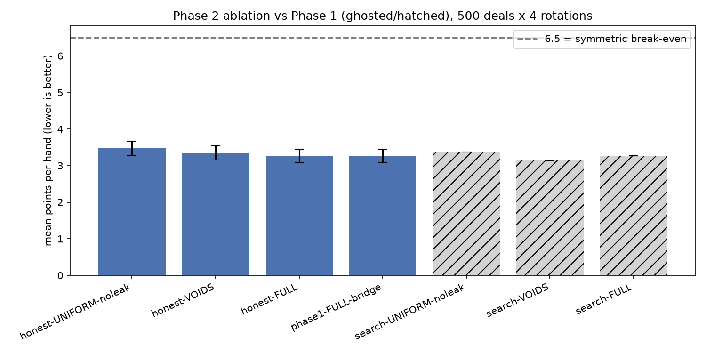
*Points per hand under honest search, by belief level. Lower is better. The order (FULL < VOIDS < UNIFORM) now matches what the belief table itself says about how much evidence each level uses — it didn't in Phase 1.*

### A JIT note

Honest search is expensive — playing out imagined games and then re-imagining more games inside them multiplies the work. Profiling showed the playout logic (not the belief math) was the bottleneck, so phases 2.5–2.7 and 3.5–3.6 replaced the hot inner loops (the heuristic playout, the sampler, the belief rebalance, and the choice-evidence audit) with `numba`-compiled kernels operating on the same bitmask representation, fused where the profiler showed it mattered. This bought roughly **20–30x** on search games end-to-end, measured JIT-on against `OPENHEARTS_NO_JIT=1` on matched deals: every game measured came in at 19.4x or better (median 24.7x, mean 31.0x), and the spread across deals is wide enough that a range is reported rather than a single figure. None of it changes what is being computed — every ported piece was checked against the original Python: bitwise-identical output wherever the computation is deterministic (the playout, the belief rebalance), and statistically indistinguishable within tolerance where randomness order can legitimately differ (the batch sampler, the choice-evidence audit). The original pure-Python code paths are kept and still tested; set `OPENHEARTS_NO_JIT=1` to run them instead of the compiled kernels, if you want to verify results without trusting the compiler.

## Phase 3: reading opponents' choices, not just their inabilities

**The idea.** The belief table (Phase 1/2) only uses *involuntary* evidence: what a player is void in, forced out by the game itself. But our heuristic opponents are deterministic — the same hand always produces the same play — which means every *voluntary* choice they make also leaks information. If the heuristic always discards its highest heart when it can't follow suit, then seeing it discard the 8♥ doesn't just show one card — it proves that opponent isn't holding anything higher (9♥ through A♥). That's evidence the constraint-only belief table (voids + hand sizes) structurally cannot see, because it never looks at *which* card among several legal ones got played.

**The mechanism: likelihood-weighted world filtering.** `WeightedPosterior` (`src/openhearts/belief/weighted.py`) samples many candidate hidden-hand arrangements the same way Phase 1's sampler did, but then asks of each one: "if this arrangement were true, and the opponents played their real policy, how likely is the sequence of moves we actually observed?" Arrangements that would have made the opponent play differently than they actually did get down-weighted (in "strict" mode, epsilon=0, down to exactly zero); the survivors are a set of worlds consistent not just with the rules, but with the *choices* actually made. An `epsilon` knob lets the audit tolerate some fraction of "off-policy" deviation, for when the opponent model is known to be imperfect.

**Headline: the 0.588 ceiling is broken.** Phase 1 found that constraint-only evidence provably tops out around 0.588 mean-probability-on-truth by trick 13 (matched to exact enumeration). Reading choices breaks that ceiling decisively (`guessing2.txt`, 500 games, all 4 seats):

| trick | CHOICE meanP | CHOICE top-1 |
|-------|--------------|--------------|
| 9     | 0.590        | 0.627        |
| 13    | 0.899        | 0.904        |

CHOICE crosses the old 0.588 ceiling by **trick 9** and reaches **0.899 mean probability on the true card / 90% top-1 accuracy** by trick 13 — a large, clean improvement over FULL's 0.588 / 0.60 at the same point.

**The partial null, stated plainly.** We pre-registered an expectation that CHOICE would approach ~1.0 by trick 13, since a fully deterministic opponent's choices should eventually pin down their hand almost exactly. It doesn't — it plateaus at 0.899, not 1.0. We checked the obvious suspect first: sampler starvation (running out of worlds to sample from). It isn't that — trick 13 still runs at a full 100 effective worlds, no thinning. The second thing we checked: of the arrangements that survive to the end, only about 41% turn out to be genuinely choice-consistent with everything observed, meaning even a hand-picking deterministic heuristic doesn't leak *everything* about its hand through its choices — some of its legal decisions are genuinely tied among cards that would have produced identical play, so no amount of choice-reading can separate them. This is a real, structural ceiling of this evidence class, not a bug or a starved sampler.

*A metric caveat:* the NLL column in `guessing2.png`'s four-line panel excludes "truth-zero" cards (cases where none of the sampled worlds happened to include the true holder for a given card — possible with a finite number of worlds, not a floor or a smoothing trick). That makes CHOICE's NLL line look better than a fully fair comparison would, since it's dropping exactly its hardest cases; meanP and top-1 are unaffected (a truth-zero counts as 0.0 / a miss, not excluded) and are the metrics to trust for the headline comparison above.

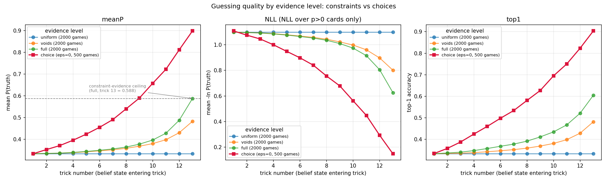

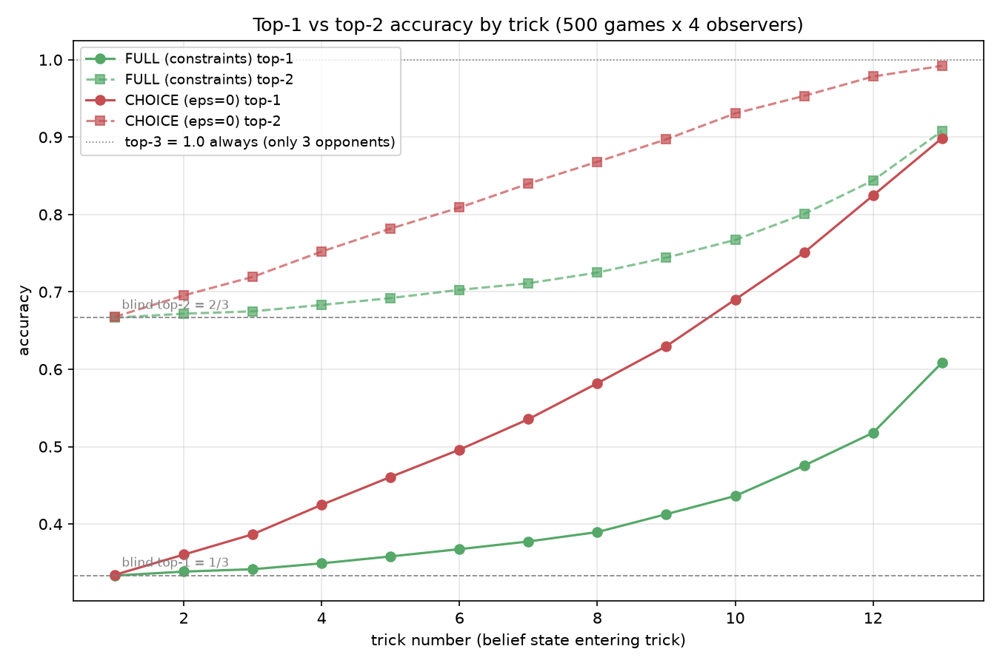

*(Top-3 is trivially 100% with only three opponents. The striking number here: CHOICE top-2 reaches 0.99 at trick 13 — the guesser's residual uncertainty is almost always between its two leading candidates, never a wild miss.)*
*Mean probability on the true card, top-1 accuracy, and NLL by trick, all four belief levels. CHOICE (reading opponents' choices) visibly separates from FULL (constraints only) starting mid-hand and crosses the old 0.588 ceiling around trick 9.*

**Survival (how often the world-filtering search runs dry).** Filtering out inconsistent worlds means some decisions can come up empty — no sampled world survives. `survival.txt` measures this under strict filtering (epsilon=0) across 300 games: the hardest stretch is tricks 6–9, where about **25% of decisions hit budget exhaustion at trick 8** (the single worst point) but total collapse — meaning *every* attempt fails and the code has to fall back — stays under 1% everywhere. The escalation mechanism sketched in planning (raising the sampling budget partway through) turned out to be unnecessary once the JIT speedup landed — the plain fixed budget was cheap enough to just run.

**Robustness: strict filtering is a double-edged sword against imperfect opponents.** Everything above assumes the opponents are exactly the deterministic heuristic the posterior is auditing against. `robustness.txt` tests what happens when that assumption is wrong: 300 games against opponents that deviate 10% of the time (`RandomizedHeuristic(epsilon=0.1)`), scored by three guessers — FULL (constraint-only, unaffected by the opponent model), CHOICE-strict (epsilon=0, assumes zero deviation), and CHOICE-soft (epsilon=0.1, matching the true deviation rate numerically, though it smooths differently than the true noise — see the file's caveat). The result: strict filtering **collapses in 96% of decisions by trick 13**, and once collapses are scored honestly as zero information (not skipped), strict is **worse than doing nothing but constraints from trick 3 onward**. Soft filtering (epsilon=0.1) never collapses and reaches 0.88 mean probability vs constraint-only's 0.60 at trick 13. The lesson: a choice-reading model that assumes a perfect opponent model is a trap against any opponent that isn't perfectly predictable — always carry some epsilon slack, even if you don't know the true deviation rate exactly.

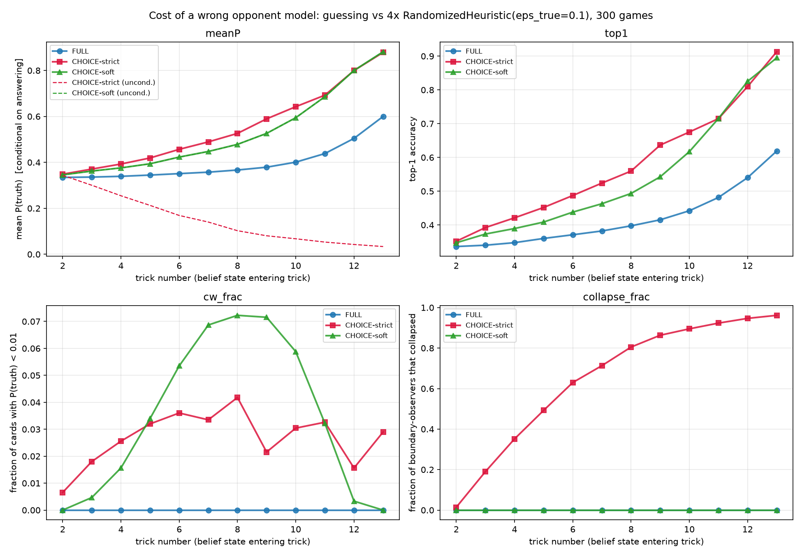
*FULL (constraint-only), CHOICE-strict (assumes a perfect deterministic opponent), and CHOICE-soft (epsilon=0.1 slack) against opponents that actually deviate 10% of the time. Strict collapses; soft holds up.*

**Full pipeline: choice-aware inference feeding honest search.** `ablation3.txt` puts it all together — `HonestSearchPlayer` whose outer worlds are drawn from `WeightedPosterior` (choice-aware, epsilon=0, which is the *correct* model here since these opponents really are the plain deterministic heuristic) instead of the raw constraint sampler, on the same 500 deals as the Phase 1/2 ablations:

| config          | mean  | 95% CI          |
|-----------------|-------|-----------------|
| honest-CHOICE   | 2.869 | [2.703, 3.038]  |
| honest-FULL     | 3.253 | [3.070, 3.447]  |

Paired per-deal (same identical-deals trick as Phase 2): honest-CHOICE beats honest-FULL by **+0.385 points/hand, 95% CI (+0.211, +0.561)** — a clear, non-null improvement from reading choices, stacked on top of Phase 2's honest search. `ablation3.txt` also reports that 44 of the run's decisions (0.2% of the ~20,700 total) hit a full posterior collapse and silently-forbidden-fallback rule kicked in, falling back to the plain constraint sampler for that one decision only — small, but stated rather than hidden, per the project's truth-safety rule.

## Phase 4: learning to imagine (Option A) — a scoped, honest null

Phases 1–3 built the bot's search around one hand-written ingredient it never questioned: when the search imagines a hidden-card arrangement and needs to know how good a candidate play is, it finishes that imagined hand with the same simple heuristic that plays the real opponents. That's a confessed-weak beginner's imagination doing the judging. Phase 4 asks whether a *learned* evaluator — trained on millions of self-played hands — can judge those imagined worlds better than the heuristic playout does, without changing anything else about the pipeline.

This is Option A of the owner's three-way roadmap decision (PROJECT.md §6.1): keep beliefs + sampled worlds + honest search exactly as Phase 2/3 built them, and replace only the "finish the imagined hand" step with a trained value function. (Option B — a direct policy network with no search at play time — and Option C — an AlphaZero-style search+network hybrid — are future bot versions; Option A builds the network C would need.) The thesis-completing bet was two hopes at once: **speed** (a value-net call is far cheaper than playing an imagined hand to the end, so the same time budget buys more sampled worlds) and **pattern accuracy** (a net trained on millions of hands might judge a position better than one playout's luck). Phase 4 tested both, and reports that neither hope paid off — precisely, and with the scope of that finding stated as narrowly as the evidence supports.

### Methodology

**Featurizer** (`src/openhearts/engine/features.py`, `FEATURES_V=1`, NF=333): a determinized position — one full, concrete deal, exactly as heuristic playouts already see it — encoded as a flat feature vector: each seat's hand (4×52 binary), cards already played (52 binary), the current trick's cards with rotated seat tags plus led suit (52+4), and scalars (trick number, trick length, hearts-broken, current-trick points, each seat's running score, whether the Q♠ has been played, remaining card counts per suit). Everything is rotated to the seat being evaluated (that seat's hand first, then next-to-act order) so one network serves all four seats.

**This point needs to be stated carefully so it isn't misread as a leak:** the value net, like the heuristic playouts before it, only ever runs *inside search, on a fully-determinized imagined world* — one concrete guess at the hidden cards, sampled from the belief table exactly as Phase 1–3's sampler already did. It sees all four hands *of that imagined world*, never of the true game. Real player code still only ever receives a `PlayerView` (own hand, plays so far, legal moves) via `GameState.view_for(seat)` — that boundary is unchanged. The information status of the value net is identical to the information status the heuristic playout always had: both look at one imagined, fully-known deal.

**Data generation** (`experiments/gen_value_data.py`): self-play games generate `(features, remaining points each seat takes from here)` at every ply, batch-featurized (one kernel call per game emits every ply's rows — no per-ply Python calls, per the phase's efficiency discipline). Player mix, pre-registered: 60% four `HeuristicPlayer`s (on-policy positions), 40% four `RandomizedHeuristic(eps=0.1)` (off-policy positions the value net will actually be asked about inside search, since search visits worlds the deterministic heuristic never reaches). Deal seeds 500000+ — a fresh range, never overlapping the 100000+ range used by every play-strength ablation, so no training deal ever leaks into an evaluation. Target was 2M positions over ~40k games; the actual run produced **40,000 games / 8,320,000 rows in 16.5s** (2,400 games/s at JIT speed) — massively under the compute budget, no background/watchdog needed. Split by game: 90% train / 5% val / 5% test, deterministic by seed.

**Training** (`src/openhearts/value/model.py`, `experiments/train_value.py`, `torch` as a training-only `[train]` extra — the play-time engine never imports it): MLP `333 → 128 → 64 → 4` (remaining points for the four rotated seats), ReLU, MSE loss, Adam, early stopping on validation. Both CPU and MPS training throughput were measured rather than assumed (2.16M vs 5.84M rows/s on this M5 Max) — MPS was faster and was used throughout. Trained weights export to a flat float64 `.npz`; a hand-written numba forward pass (`src/openhearts/value/infer.py`) does inference, pinned to the torch reference to ≤1e-6 relative agreement on real shard rows. Initial inference cost was 16.5µs/call; a sparse-first-layer optimization (most of the 333 input features are zero in any one position) brought that to **4.0µs/call**, comfortably under the pre-registered ≤20µs budget and small next to a full heuristic playout (hundreds of plies).

**Value-truncated search** (`src/openhearts/search/valuesearch.py`): `ValueSearchPlayer` extends `HonestSearchPlayer` with a `horizon` knob — `horizon=0` calls the value net immediately on the candidate world with no playout at all; `horizon=k` plays out k tricks with the heuristic, then calls the net; `horizon=∞` is required to reduce bitwise to today's full-playout behavior (a reduction test pins this, same discipline Phase 2 used for its `n_inner=0` test). `honest.py` itself was never modified.

### Results, against every pre-registered expectation

**Task 3 — can the net predict outcomes better than one playout?** Pre-registered success: MLP beats linear beats constant on test MSE, and the MLP beats "one heuristic playout" as an outcome estimator (`results/value_train_v1.txt`). The first half passed cleanly: **MLP 18.51 < ridge 22.92 < constant 29.12** (test MSE over all held-out games). The second half failed, but the failure mode itself needed explaining: on the 60% of test rows that came from pure-`HeuristicPlayer` games, "one heuristic playout" *is* a bitwise replay of the recorded future — the kernel playout is a bitwise port of that exact policy — so that baseline scores **exactly 0.000 by construction**. That's an oracle artifact, not an estimator, and the overall gate number it produces (baseline-3 overall MSE 5.45) is unwinnable for reasons that have nothing to do with net quality.

**This artifact was caught and the criterion amended before the full run**, recorded verbatim in `PHASE4_PLAN.md`: the original gate ("MLP < baseline 3" on the overall test set) is still reported as-written (**FAIL**, 18.51 vs 5.45), but the decision gate for whether Task 5 proceeds became the honest analog — MLP vs baseline 3 on the **randomized-mix rows only**, where the future is not a deterministic replay of the past (the same situation search faces: playouts run on sampled imagined worlds, not the true world). On that reading it also **FAILED**: 18.77 (MLP) vs 13.63 (one playout). Baseline 4 (mean of 20 playouts) turned out to be numerically identical to baseline 3 — heuristic playouts are deterministic given a state, so 20 playouts from one position are 20 identical playouts; reported as such rather than faked with synthetic variance.

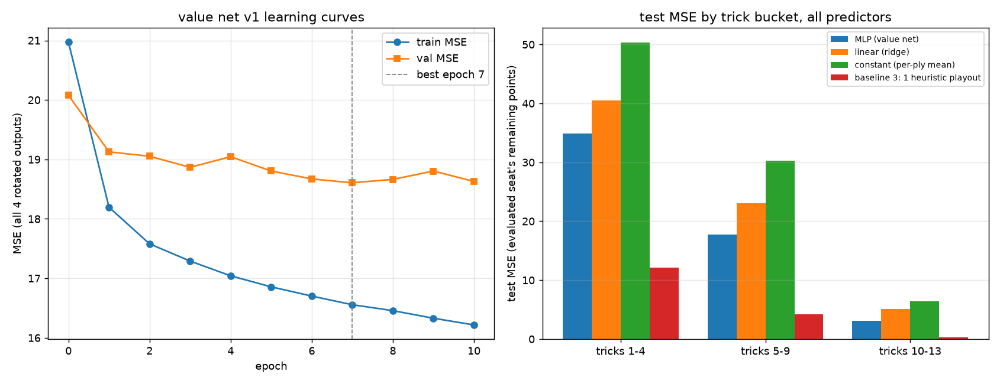

The train-vs-test gap was small (+1.55 MSE), an underfit signal, so the owner approved one bounded capacity lap before accepting the null: bigger nets, same data. It didn't help — **v1b (512/256, lr 1e-3): 19.23** (worse, lr too hot for the larger net); **v1c (512/256, lr 3e-4): 18.91** (worse, train-test gap widened to +3.13 — overfitting, not underfitting). Neither beat v1's 18.51. The underfit diagnosis was wrong; capacity was never the bottleneck. `models/value_v1.npz` (the 128/64 net) is the model that shipped forward into Tasks 4–6.

**Task 5 — the probe** (`results/value_probe.txt`, 300 sampled decisions, `Level.FULL`, n_outer=50/n_inner=20, weights=`models/value_v1.npz`). Pre-registered: "horizon 1–2 agrees with full playouts on a large majority of decisions at a fraction of the cost; horizon 0 is fastest and least accurate." Read clause by clause, with "large majority" fixed at ≥0.75 before the run:

| horizon | agreement w/ full playout | s/decision | speedup | net calls/decision |
|---------|---------------------------|------------|---------|---------------------|
| 0       | 0.42                      | 0.0024     | 54.7x   | 218.7               |
| 1       | 0.50                      | 0.0239     | 5.6x    | 4610.0              |
| 2       | 0.56                      | 0.0994     | 1.34x   | 19063.6              |
| ∞ (None)| 1.00 (by construction)    | 0.1333     | 1.0x    | 0                   |

**The "large majority" clause FAILS at every horizon** (agreement 0.42–0.56, not ≥0.75) — reported plainly. The speed clauses pass: horizon 0 is fastest (54.7x) and least accurate, as expected, though horizon 0 never reaches an imagined own-decision inside honest search, so re-determinization never fires for it — that row is really Phase-1 determinized search plus a learned evaluator, and is labeled that way throughout, not honest search. Low agreement was not pre-judged as a weakness (a value net could in principle disagree with a playout and still be *right*) — Task 6's actual points-per-hand ablation was designated as the real judge, per plan.

**Task 6 — the headline ablation** (`results/ablation4.txt`, 500 deals, seeds 100000+, identical to Phases 2–3, paired per-deal bootstrap against the honest-CHOICE bridge row):

| config | mean | 95% CI | paired diff vs bridge |
|--------|------|--------|------------------------|
| honest-CHOICE (bridge, reproduced) | 2.869 | [2.703, 3.038] | — |
| value-CHOICE-h1 | 3.474 | [3.301, 3.650] | +0.605 [0.409, 0.802] |
| value-CHOICE-h1-eqt (equal wall-clock) | 3.474 | [3.295, 3.660] | +0.606 [0.409, 0.800] |
| value-CHOICE-h0-eqt ("determinized+net") | 6.173 | [5.914, 6.439] | +3.304 [3.036, 3.575] |
| heuristic-mirror (6.5 alarm) | 6.500 | [6.500, 6.500] | +3.631 |

The bridge integrity check passed first: honest-CHOICE reproduced **2.869** exactly, matching Phase 3, and the heuristic-mirror alarm landed exactly on 6.500. Pre-registered success was row 3 (`value-CHOICE-h1-eqt`, the fair fight at equal compute) beating the bridge with a CI excluding zero in our favor; pre-registered fallback was that row 2 (pure evaluator swap, same world count) might show small improvement or parity-plus-speedup. **Both rows lost, decisively** — this is the pre-registered both-rows-lose outcome, a reportable null, not a maybe.

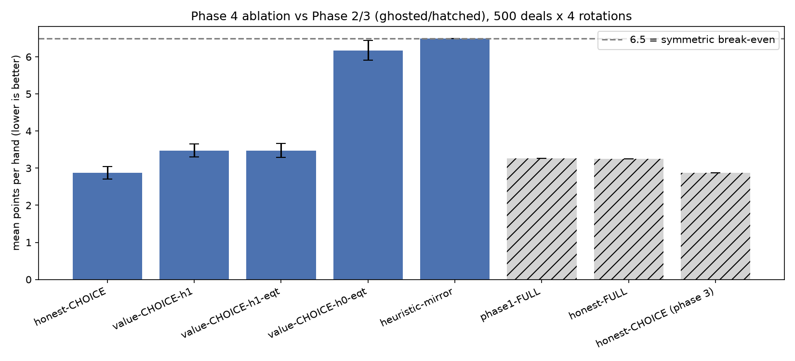

The single most load-bearing number in this table is that **h1 (3.474) and h1-eqt (3.474) are identical to three decimal places**. h1-eqt tripled the number of sampled worlds (n_outer 50→150, n_inner 20→60) for the same wall-clock budget the bridge row spends, and it bought **0.001 points** — statistically nothing. That means the speed dividend the whole bet depended on ("faster evaluation buys more worlds, more worlds buys better play") is real but doesn't matter here: a worse evaluator scored three times as many worlds and the answer didn't move, because evaluator *quality* is what search strength is bottlenecked on here, not evaluator *count*. h0-eqt (determinized search with a learned evaluator, no honest re-determinization) did worse still, at 6.173 — barely below the plain heuristic-mirror's 6.5.

**Task 6.5 — the distillation retry** (owner-approved redesign of the training target, `results/value_train_v2*.txt`). Task 6's null diagnosed the *labels*, not necessarily the network: outcome labels (what actually happened) carry irreducible future randomness that no position-function can predict, so the best net available might just be hedging toward averages. Distillation replaces the label with "what would one full playout from here say?" — the exact, noise-free quantity search consumes, generable at kernel speed with zero label noise. Pre-registered gate, before any run: imitation test MSE ≤4.0 (roughly ±2 points typical error against a zero-noise target); if it stays near the outcome-label numbers (~13–18), the net cannot represent playout judgment at all and 4A closes with a strengthened null, no ablation rerun.

**v2 (128/64, same architecture as v1): test MSE 17.08 — FAIL** against the ≤4.0 gate, barely below v1's outcome-label 18.51. Baseline 3 is 0.000 by definition on these labels (the label *is* the playout — stated, not celebrated) and drops out of the comparison entirely. The label-noise diagnosis was wrong: the true limitation is representational. The playout's judgment turns out to be dominated by exact forced-sequence logic — who must win which trick, where the Q♠ has to land — which an MLP over marginal, position-summary features cannot express at any label quality. A concrete example of the kind of thing the net can't see: if West has led a suit everyone else is void in except South, South's move is forced regardless of anything a marginal per-card probability could encode — the *interaction* between which specific cards are where, not any single card's marginal presence, decides the trick, and a network trained on marginal features has no slot to represent that interaction faithfully at 333-feature width.

Per pre-registration, gate 1 failing meant **no ablation rerun** — 4A closed here. As requested by the owner, the capacity lap was repeated one more time on these clean, noise-free labels to rule out capacity as the confound a second way: **v2b (512/256, lr 3e-4): 18.57**, **v2c (1024/512, lr 2e-4): 18.85** — both *worse* than v2's 128/64 net at 17.08. Even an 8x–30x larger network gains nothing on noise-free labels; the imitation ceiling is insensitive to capacity in this function class, featurization, and training recipe.

The trick-bucket pattern is consistent and instructive across every training run (v1 and v2 alike): early-position MSE is roughly **32 (tricks 1–4)** versus **2.8 (tricks 10–13)** on v2's clean labels. Early positions are where the most forced-sequence chaos remains ahead — effectively a ~40-ply deterministic cascade the net has to predict the outcome of from a still-mostly-hidden position; by the last few tricks there's little left to predict and every predictor (including the constant baseline) converges toward the small residual truth.

### The scoped conclusion

**What is proven:** a shallow MLP over 333 marginal-feature summaries of a position, run at microsecond CPU inference, cannot match an exact ~100µs simulator at judging near-heuristic play. This was shown five separate ways: worse outcome-MSE than one playout on the honest randomized-mix comparison (Task 3); no gain from 8x extra capacity on outcome labels (Task 3 lap); +0.605 pts/hand *worse* in real play at equal search size (Task 6); identical score at equal wall-clock — tripling the world count with a worse evaluator bought 0.001 points, meaning evaluator quality binds and not compute (Task 6); and on the easiest possible exam — imitating the playout itself with zero-noise labels — 17.08 MSE against a ≤4.0 gate, insensitive to 8x–30x more capacity (Task 6.5). The Phase 2–3 JIT work makes this an unusually hostile benchmark to beat: the simulator being competed against is cheap, exact, and correct-by-construction against exactly the opponents it's being scored against.

**What is explicitly NOT proven, and left open:** GPU-batched large-net inference (batching the roughly 20,000 net calls a single decision makes into a handful of MPS calls changes the compute economics entirely — untested here); a **learned playout policy** (making the simulator itself smarter rather than replacing it with a position-summary net — untested); Options B (direct policy network) and C (search+network hybrid with an iterated training loop) — neither attempted, both remain future bot versions; and every learned component whose competitor is *not* an exact simulator — most importantly opponent models for Phase 5, where there is no simulator of a human to lose to in the first place, so this null does not transfer. The owner's stated rationale for a future value-learning rematch: against human-like opponents the exact-heuristic simulator loses its "oracle" status (it becomes exact-but-wrong, and Phase 3's robustness result already showed strict-mode collapse at just 10% opponent deviation) — so a learned evaluator judged against a simulator of *real* human play, rather than against a simulator of the very heuristic it was trained to imitate, is a genuinely different and still-open contest.

Per plan, Stage 4B (one ExIt-style improvement iteration) is **HALTED** — regenerating training data with a bot built on a losing evaluator would iterate on a losing evaluator, so it does not proceed without a redesign the owner has not yet approved.

### The bot league (the standing benchmark)

The Task 8 round-robin: every bot generation plays 100 identical deals (seeds 100000+, rotated seating, 4 games/deal) as ROW bot — one of it at the table against three of the COLUMN bot. Lower is better for the row bot; 6.5 is break-even.

| row \ vs trio of | random | heuristic | p1-search-FULL | honest-FULL | honest-CHOICE | value-h1 |
|---|---|---|---|---|---|---|
| random | 6.37 | 11.91 | 14.07 | 13.75 | 14.34 | 13.83 |
| heuristic | 3.05 | 6.50 | 10.79 | 10.30 | 10.37 | 9.48 |
| p1-search-FULL | 1.80 | 3.26 | 6.53 | 6.20 | 6.59 | 6.19 |
| honest-FULL | 2.05 | 3.41 | 6.74 | 6.61 | 6.33 | 6.56 |
| honest-CHOICE | 2.15 | 2.62 | 6.36 | 6.81 | 6.16 | 6.44 |
| value-h1 | 1.87 | 3.48 | 6.54 | 6.45 | 6.53 | 6.98 |

(95% bootstrap CIs over deals in `results/league.txt`; at 100 deals/cell they are roughly ±0.3–0.7 — wider than the 500-deal ablations, by design: this table is a map, not a microscope.)

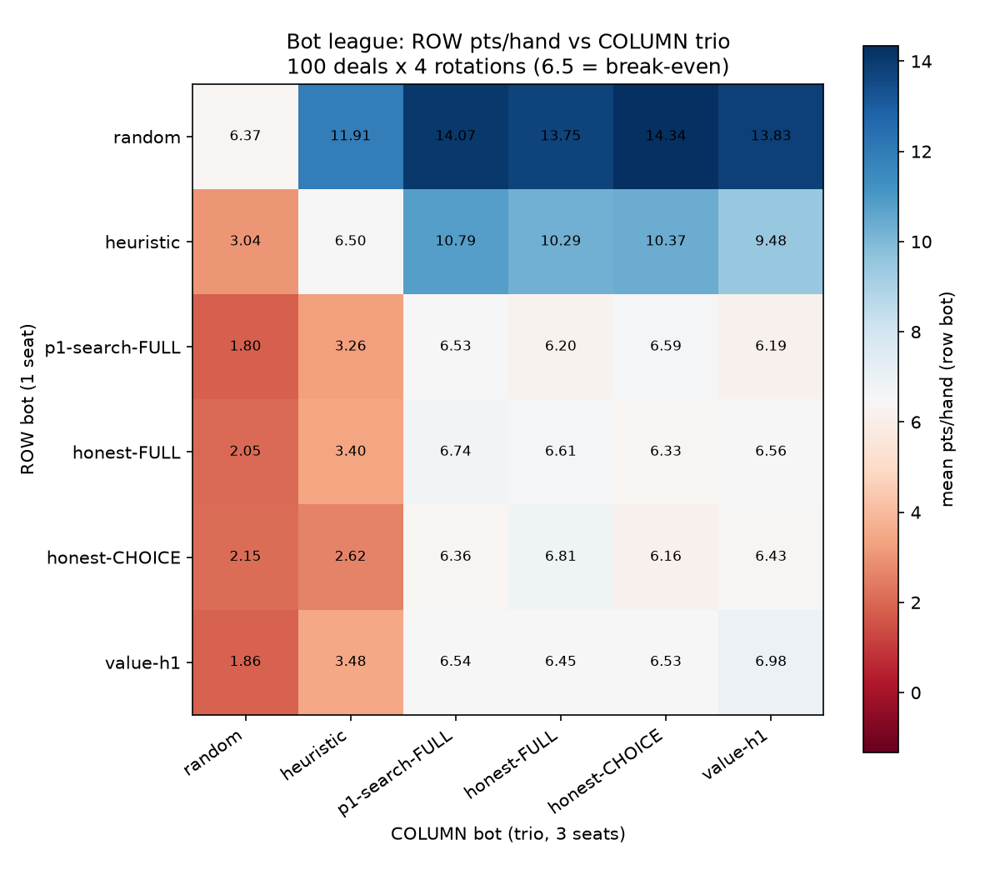

**Integrity first:** the vs-heuristic column reproduces every previously-published number within CI (p1-search 3.26 ≈ 3.27; honest-FULL 3.41 vs 3.25; honest-CHOICE 2.62 vs 2.87; value-h1 3.48 vs 3.474), the heuristic mirror is exactly 6.500, and five of six diagonal self-mirrors bracket 6.5 — the exception (value-h1 vs itself, 6.98, CI [6.57, 7.40]) is the single ~2-sigma outlier expected by chance among 36 cells at 95% confidence, noted rather than hidden.

**What the table says, in three findings:**

1. **The search bots are nearly evenly matched against each other.** Every search-vs-search cell sits in the 6.2–7.0 band — no search generation reliably beats another search generation's trio. The ladder that looked so steep against the heuristic (3.26 → 2.62) compresses to statistical parity when the opponents also think.
2. **honest-CHOICE's crown is home-turf specific.** Its signature edge (2.62 vs the heuristic trio, the best single cell in that column) comes from reading choices under the assumption that opponents ARE the heuristic. Against search-bot opponents that assumption fails and the collapse counters in `league.txt` show it: the choice posterior collapses on roughly **85% of decisions** (e.g. 3,521 collapses in ~4,100 decisions vs its own trio), silently degrading it to constraint-only sampling. This is the sharpest measurement yet of limitation 8, and the cleanest quantitative motivation for Phase 5's learned opponent models.
3. **Everyone beats random, and the heuristic loses ~10/hand to any search trio** — the sanity floor and ceiling both hold.

This matrix is the standing benchmark future bot versions (Options B and C, and Phase 5's opponent-modeled bots) plug into.

## Phase 5: reading opponents who were never scripted

Phase 4 closed on a scoped null and a live question: honest-CHOICE's crown (2.87 pts/hand, the best number in the whole project) turned out to be heuristic-specific. The league (Phase 4's closing table) measured it directly — against any opponent that wasn't the exact modeled script, the choice posterior collapsed on roughly 85% of decisions, silently degrading back to constraint-only reading. Phase 5 asks the obvious next question: can the bot beat opponents it has never seen?

**Why manual human data couldn't answer this.** The honest arithmetic, stated once and then acted on: a human can produce maybe 20 hands of Hearts in an evening; the project's synthetic pipeline produces 200,000 games in about 2.5 minutes. No realistic amount of manual play could ever build a training set an order of magnitude smaller than what earlier phases treated as a smoke test, let alone a real one. So Phase 5 committed, by owner decision, to **synthetic-only training**: build a population of unpredictable synthetic opponents, train against them, and evaluate against held-out members of that same population. The terminal relay harness (originally planned as a live-data collector for this phase) was redesigned out of Phase 5 entirely — it returns later as a deployment/validation channel for a bot that's already been proven, not as this phase's fuel.

**The A-organs framing.** Phase 4's league pointed at two things breaking together: the belief posterior (what we think opponents hold) and the imagined playouts (what we think opponents will *do* with what they hold), both built around one fixed heuristic script. Phase 5 names these two repair jobs "organs," built from one shared learned artifact (a profiler that predicts P(card | position)):
- **Organ 1, READING** — the profiler's predictions plugged into the belief posterior's likelihood socket (the same socket Phase 3's `WeightedPosterior` built for exactly this).
- **Organ 2, IMAGINING** — the same profiler recast as the opponents' policy *inside* imagined playouts, so a rehearsed hand is played out by something more realistic than the fixed heuristic.
- **Organ 3, RL on our own policy**, is explicitly *not* built this phase — it's gated to Phase 6, and only justified if Phase 5's evidence says organs 1+2 aren't enough.

**The two-sided RL gate.** Rather than pre-committing to "if X fails, do RL," the plan pre-registered a symmetric test with an oracle row as the tie-breaker. `profiled-ORACLE` reads with the *true* personality parameters — a model that could never be deployed (it requires knowing exactly who you're playing before the hand starts) but is cheap to simulate, and therefore measures the absolute ceiling of what reading could ever buy. Phase 6's RL trigger fires if **either** (a) the bot's best profiled row still loses to the primary baseline (RL because reading fell short), **or** (b) even the oracle's edge over the baseline is small (RL because reading is provably tapped out, even with perfect knowledge). Both halves needed a number to check against, not a guess — that's what the rest of this section reports.

### Methodology

**Personality population** (`src/openhearts/players/personality.py`, Task 1). 12 interpretable axes drive each `PersonalityPlayer`'s soft-max scoring over legal moves — duck-vs-take appetite, discard style (hoard vs dump), Q♠ posture, lead style, heart-dumping aggression, per-suit quirks, a continuous q-strength axis, a pot-sensitivity ("danger") axis, and a "temperature" (conviction) axis, plus a per-personality noise level epsilon (0.03–0.25, the fraction of decisions that fall back to a uniform legal draw). This is deliberately not a wrapped heuristic-plus-noise (that family already exists as the anchors) — personalities are scored choices from hand-coded feature weights, distinct by construction. 200 personalities were drawn for training, 50 held out, split by personality seed **at creation**, before any data touched them — the "held-out wall." Divergence gates passed with comfortable margins: mean pairwise per-decision disagreement 0.601 against a pre-registered floor of 0.15, and mean disagreement from the plain heuristic 0.538 (min 0.264) against a floor of 0.10 — the population doesn't secretly collapse back into the heuristic it's supposed to be unlike. Mirror sanity (four copies of one personality, rotated seats) bracketed 6.5.

**7.89M choice events** (Task 2, `experiments/gen_population_data.py`). Self-play across the 200 train personalities generated one row per *decision* (not per ply-per-seat, unlike Phase 4's value data) — 200,000 games producing 7.89M decision events in 147.5s (1,356 games/s), 39.46 decisions/game. Featurization reuses Phase 4's `FEATURES_V=1` layout (NF=333) but structurally zeroes every hidden-hand block, since a profiler modeling what a player *chooses* must only ever see what that player could legitimately see. This "hidden-hand independence" was proven by byte-identity of the featurized row under two differing completions of the hidden cards — not asserted, checked. The held-out wall was asserted in-generator: 0 of the 50 held-out personalities appear in any training shard.

**Profiler: GENERIC + CONDITIONED, masked cross-entropy** (Task 3, `src/openhearts/opponent/model.py`, `models/profiler_v1.npz`). A small MLP (333→256→128→52) predicts logits over all 52 cards, masked to the legal set and softmaxed, trained with cross-entropy on the chosen card restricted to legal moves. Two variants were trained on identical rows in identical order: GENERIC (no personality input — the deployment model for unseen opponents) and CONDITIONED (true personality params appended to the input — a ceiling, used only to measure how much *knowing who you face* is worth). Evaluation ran once, after training, on a fresh 10,000-game block drawn only from the 50 held-out personalities (394,560 decision events) — never touched by training or model selection (early stopping used train-personality validation loss specifically to avoid breaching the wall).

**Mixture adaptation** (Task 5, `src/openhearts/opponent/adapt.py`). `SeatMixture` keeps a Bayesian weight distribution over a fixed pool of K=32 reference personalities (seeded subsample of the train pool), updated from observed (view, chosen-card) events as a match proceeds, and blended with the GENERIC profiler at a pre-registered weight (b=0.2, chosen by a train-side-only sweep). Updates accumulate across hands within a match and reset only on reseating. Identification concentrated weight (w>0.5) on the true pool member by hand 9; against held-out personalities not in the pool at all, the adapted mixture beat GENERIC likelihood at every hand count measured, including by hand 3 as pre-registered.

**Model-driven playouts** (Task 6a, `src/openhearts/search/profiled.py`). A new kernel playout path has opponent seats sample from the profiler's masked distribution (seeded numba rng, statistically pinned per the Phase 2.6 precedent) instead of the fixed heuristic; a reduction test confirmed that swapping the profiler for a one-hot heuristic-match distribution reproduces heuristic-playout scores exactly, so the new path is provably a strict generalization of the old one, not a different computation by accident.

**Match-blocked ablation design** (Task 6). The headline ablation uses 500 deals arranged as 20 match-blocks of 25 deals each, each block played against one fixed held-out trio throughout. This blocking wasn't cosmetic: mixture adaptation ("getting to know you") only means anything if the bot faces the *same* opponents across consecutive hands — a design where every deal drew a fresh random trio would give the adaptive row nothing coherent to adapt to, making the adaptation comparison meaningless by construction, not just noisy.

### Results, against every pre-registration

**Task 3 — profiler quality vs baselines (`results/profiler_train.txt`).** Gate 1 (GENERIC beats uniform-over-legal AND heuristic+eps=0.1 on held-out log-likelihood) **PASSED**: GENERIC LL −1.2616 > uniform −1.3009 > heuristic+eps −2.4029. That last number is worth sitting with — assuming the opponent *is* the old heuristic-plus-10%-noise model and staking 0.9 probability accordingly is **catastrophically overconfident** off home turf, worse than assuming nothing at all. Gate 2 (top-1 ≥ baseline-2 + 5 points) **FAILED on margin**: GENERIC's actual top-1 edge was +2.41 points, not +5.0. The diagnosis, read against the oracle row (each personality's exact mixture density, the information-theoretic floor, at −1.1352 nats): the population is noisy *by design*, and GENERIC already captured 24% of the entire uniform→oracle headroom. The full headroom to the oracle is only +0.1265 nats — there isn't much more mass sitting between GENERIC and perfect population-level reading, let alone between GENERIC and *identity*-level reading. CONDITIONED (true params supplied) reaches +8.17 top-1 points over GENERIC, so the +5 margin was reachable — it lives specifically in **knowing who you're facing**, which became Task 5's mandate.

**Guessing off home turf (`results/guessing5.txt`, 500 held-out games).** Three of four pre-registrations **PASSED**: PROFILER beats CHOICE-soft overall (0.4123 vs 0.4069 meanP, +0.0054); CHOICE-strict collapses exactly as Phase 3's robustness result predicted (collapse_frac reaches 1.000 by trick 6 and stays there); PROFILER never confidently excludes the truth (truth-P<0.01 fraction ≤0.0005). The one **FAIL** is honest but hollow: "PROFILER beats FULL at every trick" loses at trick 1 by −0.0000 — trick 1 has no observed opponent plies at all, so every candidate world carries equal weight and the delta is 100-world sampling noise against FULL's exact marginals, not a reading failure (flagged in the script *before* the run, not explained away after). The sobering number this run surfaces for Task 6: PROFILER-ORACLE (perfect identity, model-driven reading) reaches only 0.4347 overall meanP — the reading-value ceiling over CHOICE-soft off home turf is **+0.0277 meanP**, compared to home turf's +0.31 (CHOICE at 0.899 vs FULL's 0.588 in Phase 3). Reading a noisy stranger is worth an order of magnitude less than reading a known script.

**The headline ablation (`results/ablation5.txt`, `results/ablation5_console.log`, 500 match-blocked deals vs held-out trios).** Every pre-registered criterion letter **PASSED**:

| config | mean | 95% CI | paired diff vs CHOICE-soft |
|---|---|---|---|
| honest-FULL | 2.345 | [2.172, 2.515] | — |
| honest-CHOICE-strict | 2.485 | [2.304, 2.663] | — |
| honest-CHOICE-soft | 3.443 | [3.243, 3.646] | (baseline) |
| profiled-R | 2.687 | [2.499, 2.873] | −0.757 [−0.979, −0.537] |
| profiled-RI | 2.409 | [2.241, 2.572] | −1.035 [−1.257, −0.813] |
| profiled-RIA | 2.401 | [2.239, 2.564] | −1.043 [−1.256, −0.828] |
| profiled-ORACLE | 2.393 | [2.228, 2.558] | −1.050 [−1.262, −0.832] |
| personality-mirror | 6.556 | [6.316, 6.802] | — |

PRIMARY (RI and/or RIA beats CHOICE-soft, CI excludes 0): PASS. SECONDARY (monotone R → RI → RIA): PASS (2.687 → 2.409 → 2.401). HEADLINE (best profiled row < 6.5 and primary met): PASS, best row 2.393 ≪ 6.5. Two-sided RL gate: **not triggered on either side as written** — the primary criterion passed, and the oracle's magnitude of edge over CHOICE-soft (−1.050) clears the ≥0.3 threshold that would have signaled reading was tapped out.

**The letter-vs-substance split — the honest headline the letter masks.** The pre-registered baseline to beat was CHOICE-soft. But CHOICE-soft off this population is actively *harmful*: at 3.443 it's worse than doing nothing but constraint-only reading (honest-FULL, 2.345) and worse than even CHOICE-strict (2.485, which mostly survives by falling back to the constraint sampler on its frequent collapses). The letter of the pre-registration compared every profiled row to a baseline that was itself broken. Measured against the *true* incumbent — honest-FULL, plain constraint-only beliefs with heuristic playouts — **honest-FULL beats every profiled row in the table, including the deployment-impossible oracle** (2.345 vs profiled-ORACLE's 2.393). Reading, even with perfect identity knowledge, buys essentially nothing in points against this population once measured against the right baseline. This is the same shape as Phase 4's finding, restated with a different learned component: the exact, simple method beats the learned one, again — this time not because the learned component was bad at its job (the profiler genuinely reads better than CHOICE-soft, as the guessing curves showed), but because *reading itself* has little headroom left to give against opponents this noisy.

**Why strict beats soft here (a mechanism, not a coincidence).** CHOICE-strict's collapses (its posterior finding zero surviving worlds, forcing a fallback) happen on the large majority of decisions off home turf — and the fallback is the constraint-only sampler. So CHOICE-strict is functionally "honest-FULL with extra steps" for most of a hand, and scores close to it (2.485 vs 2.345). CHOICE-soft never collapses, so it never gets that safety net — it commits to a smoothed-but-wrong likelihood on every decision and pays for the wrongness the whole way through, landing at 3.443. A model that fails loudly and falls back to something honest beats a model that fails quietly and keeps going.

**Follow-up row: Organ 2 doesn't stack (owner-approved rerun after the 5.5a/b interlude; rows 1–8 reproduced exactly).** The headline table's own diagnostic left one thing unresolved: Organ 2 (model-driven playouts) looked like the one real positive in the run, worth +0.28 points/hand on its own (profiled-R 2.687 → profiled-RI 2.409). But R already had distorted beliefs from reading; the follow-up row `FULL-profiled-playouts` (honest-FULL's beliefs, paired with Organ 2's model-driven playouts) tests whether realistic playouts add value on their own, independent of reading. Result: **2.354**, paired vs honest-FULL **+0.009, CI (−0.181, +0.196)** — a CI that straddles zero by a wide margin. Organ 2's apparent +0.28 gain wasn't adding independent value; it was **repairing damage that reading had introduced into the beliefs it was rehearsing against**. Take reading out of the picture and realistic playouts add nothing measurable on top of constraint-only beliefs.

**Adaptation ≈ 0 points despite working in likelihood currency.** Task 5's mixture adaptation genuinely worked as a *likelihood* improvement (paired deltas positive at essentially every hand count vs GENERIC, headroom captured up to ~59% by hand 6). But in the headline ablation's points currency, profiled-RIA (2.401) is statistically indistinguishable from profiled-RI (2.409) — the RIA/RI quartile diagnostic shows RIA's score is flat across the match-block (q1=2.244 through q4=2.346, no visible "getting to know you" improvement over the course of a block in points terms), even though the underlying mixture weights do concentrate correctly (a block's final identity-0 mixture weight reaching 0.99997 by the end). Getting better at guessing who you're facing didn't translate into playing better against them, in this population, at these stakes.

### The scoped conclusions

**(a) Against this noisy population, constraint counting is king, and reading is tapped out even with perfect identity knowledge.** Honest-FULL — the simplest, cheapest, most exact belief model in the whole project — is the best row in the headline table, beating every learned component including the impossible oracle. The two-sided RL gate's *letter* didn't trigger (both halves technically passed as written against CHOICE-soft), but its *substance* points the same direction the gate was designed to catch: reading has run out of runway against this kind of opponent. The argued next step (Phase 6) is policy improvement — Organ 3, RL on our own decision policy — rather than another rung of reading.

**(b) The standing caveat cuts the other way for real humans.** This entire phase's population is whim-heavy by construction: 12 axes plus a noise floor of 3–25% per decision. Real humans playing Hearts are plausibly far more habitual — the same player tends to duck the same way, hoard the same way, hunt the Q♠ the same way, hand after hand — which is exactly the kind of regularity that made honest-CHOICE's home-turf number (2.87, reading a fixed script) so much stronger than anything reading buys here. Whether reading's value against real people looks more like home turf (large) or this population (near zero) remains genuinely open; this phase answers the synthetic question honestly, not the human one.

**(c) The Phase-4 rhyme, stated plainly.** Exact and simple beats learned, again, at the points level — the same shape Phase 4 found when a trained value net lost to an exact simulator at judging positions. Here the story completes one turn further: the learned profiler is demonstrably *better* than the heuristic script at reading noisy strangers (it wins the guessing curves cleanly), but being a better reader doesn't matter when reading itself has little value left to extract from opponents this unpredictable.

### Infrastructure

**Phase 5.5a — checkpoint-resume fix.** A truncation bug in `run_ablation5.py`'s checkpointing cost one full 85-minute rerun of the headline ablation before it was caught. The fix banks full chunk payloads (JSON v2, with a legacy loader for the old format) and appends rather than truncates on resume; the owner-approved `FULL-profiled-playouts` follow-up row (config id 5108) was appended in the same pass.

**Phase 5.5b — bitwise-fused profiler audit.** A fused kernel (`src/openhearts/engine/kernel_audit_profiled.py`) combines replay, featurization, and the net forward pass into one crossing with shared-source operations throughout. The bitwise gate passed (11,154 comparisons over 3,718 (view, world) pairs, 0 mismatches including −inf dead worlds; posterior outputs byte-identical on 200 views). The honest speedup was modest: **1.36x** (26.8ms → 19.7ms per posterior) — stated without spin, because the audit turned out to already be net-compute-bound, not glue-bound, so fusing the surrounding code had limited room to help. The mixture (RIA) path still falls back to Python by design; further fusion there is deferred (5.5c scope, not built).

**Phase 2.8 (pre-drawn seeds for the fused decision kernel), still pending.** Deferred since Phase 4 and reconfirmed deferred this phase — must not be enabled mid-experiment per the plan's efficiency discipline; noted here as a standing item, not resolved by Phase 5.

### Plots

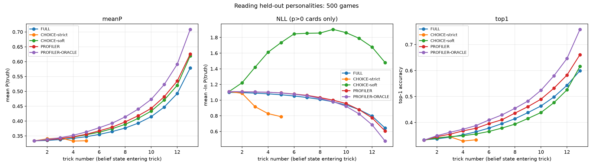

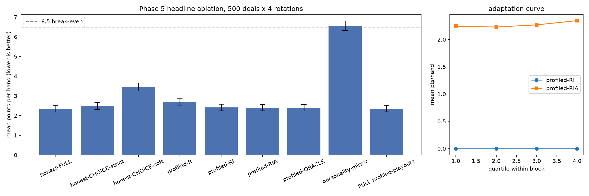

## Current performance at a glance

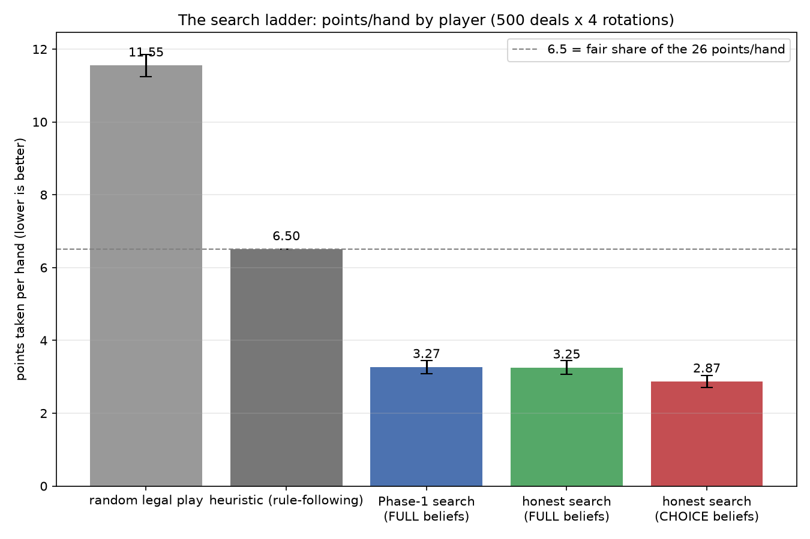

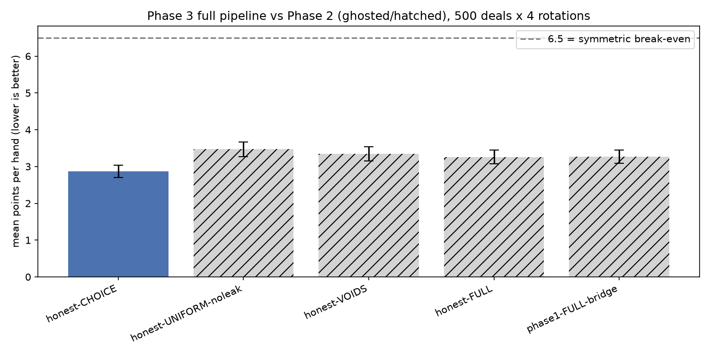

One axis, whole story: random legal play eats 11.5 points a hand, a competent rule-follower 6.5, any sampled-playout search roughly halves that, and choice-aware beliefs through the honest search reach 2.87 — an 11% share of each hand's 26 points, against opponents taking ~30% each.

## Phase 6: contact — a real opponent, and a look in the mirror

Phase 5 closed on a live question: reading opponents (Phase 3's crown achievement, 2.87 pts/hand against a fully scripted heuristic) bought almost nothing against Phase 5's noisy synthetic population — even a mind-reading oracle gained nothing there. But that population was deliberately whimsical (3–25% pure noise per decision, by design). Real people aren't whim machines; they're creatures of habit. Phase 6 asks three questions the project had never asked before: was reading tested only in a hurricane (**6A**)? How do we actually compare to somebody else's Hearts bot (**C-bench**)? And how hard could a dedicated student hit our own bot back (**6C**, exploitability)? A fourth prong, **6B** — a terminal relay for logging real human games — was fully specified this phase but its build was deferred to background work; the owner waived the live-session gate rather than wait for it, so everything below is still measured against synthetic opponents or against the bot's own reflection, not against people.

### 6A: the entropy curve (2026-08-19) — reading, tested at last against habit

**The idea.** Rebuild the Phase 5 personality population with one new dial, **habit strength**, running from H0 (near-deterministic habits — epsilon 0.005–0.02, strong convictions) to H3 (noisier than Phase 5's own population). Everything else about a personality — its original 12 style axes, plus three new Phase-6 axes added to widen the strategy space (*safe-trick high-dumping* — the "Priya move": fourth to a safe trick holding Q♣ and 8♣, deliberately winning with the Q♣ to unload a dangerous high card cheaply; *void engineering* — deliberately playing off a short suit early to set up a discard-ready void; *leader-feeding* — dumping points on whoever is already winning big) — stays fixed at every setting; only predictability moves. The guessing curves and a slim paired ablation (honest-FULL, CHOICE-strict, profiled-R, profiled-ORACLE) then re-run at each setting, on the *same* 250 deals and the *same* held-out trios throughout, so the dial is the only thing that changes.

**The curve** (`results/entropy_curve.txt`; reading value = paired per-deal honest-FULL − reading row; positive would mean reading beats plain counting):

| setting | entropy (nats) | honest-FULL | ORACLE (perfect identity) | ORACLE reading value | 95% CI |
|---|---|---|---|---|---|
| H0 — near-deterministic habits | 0.697 | 2.739 | 2.941 | −0.202 | (−0.452, +0.048) |
| H1 | 0.953 | 2.393 | 2.795 | −0.402 | (−0.678, −0.131) |
| H2 — ≈ Phase 5's range | 1.179 | 2.284 | 2.624 | −0.340 | (−0.600, −0.082) |
| H3 — noisier than Phase 5 | 1.300 | 2.110 | 2.469 | −0.359 | (−0.602, −0.115) |

Reading — even ORACLE, the deployment-impossible row that's handed the opponent's *true* personality — HURTS at every predictability setting, three of four CIs excluding zero entirely. The best number anywhere, including the rare-moment slices (deals where the Q♠ is live and exposed), is H0's QS-EXPOSED cell at **+0.064 pts/hand**, nowhere close to the pre-registered +0.3 survival bar.

**Against pre-registration, verbatim:** "reading value increases monotonically as habit strengthens" — **FAILS** (H3 −0.359 → H2 −0.340 → H1 −0.402 → H0 −0.202, not monotone). "at H0 it becomes clearly positive (≥0.3)" — **FAILS** (−0.202). "at H2 it lands near Phase 5's ≈0" — **FAILS** (−0.340 vs. Phase 5's −0.048; a real finding about the new contextual axes, not a harness bug). Two expectations **PASS**: CHOICE-strict's collapse rate does fall as habit strengthens (0.831 at H0 → 0.836 at H3, exactly the pre-registered "habitual ≠ script-like" possibility), and the rare-moment slices do exceed the overall mean at some settings.

**Three findings worth carrying forward.** (1) *The guessing-vs-points inversion, a third time, sharper than ever*: at H0, ORACLE guesses the true card with mean probability 0.475 against honest-FULL's 0.390 — genuinely better reading — while still losing points. Working hypothesis, labeled as such: likelihood-weighting narrows the diversity of imagined worlds, so a sharper-looking posterior can quietly be a *narrower*, not just a *more accurate*, one. (2) *Habitual opponents are harder for everyone*, reading or not: honest-FULL alone scores 2.74 pts/hand against H0 opponents versus 2.11 against H3 — discipline beats caprice regardless of whether anyone is reading it. (3) The dial worked as designed — H0 personalities are habitual in their *own* 15-axis style, including the three new moves the old beginner script cannot predict at all, so "habitual" turned out not to mean "predictable by the old script."

**Verdict, per the pre-registered decision rule.** Reading value stayed under +0.3 at every H0/H1 setting, overall and rare-moment slices alike → **reading is RETIRED from the main line** (archived, not deleted). Consequence: the bot's identity is now settled — count perfectly, search hard, assume nothing about the opponent — and the Phase 5 profiler/adaptation machinery (Organs 1 and 2) stops receiving further investment. Standing caveat: this is still synthetic evidence; 6B's human logs, whenever they land, are the only thing that can actually overturn it.

**Post-close addendum (2026-08-28, Phase 7 Task A1): the mechanism behind this curve has been isolated, and it changes what the curve means.** Every reading row above delivers opponent information by likelihood-*weighting* the sampled worlds — and instrumenting the archived ORACLE configuration showed that after weighting, only ~7–23 of its 50 imagined worlds carry any effective weight through the middle game (the rest are near-zero; the "average over 50 worlds" is really a handful of worlds photocopied). Rebuilding the same row with sampling-importance-resampling — oversample a candidate pool until effective sample size recovers, weight with the *byte-identical* oracle likelihood, then resample 50 genuinely diverse equally-weighted worlds — removed the penalty at both settings tested, paired on the same deals: at H0, ORACLE-SIR scores 2.606 vs the archived ORACLE's 2.941 (−0.335, 95% CI [−0.587, −0.080]) and lands 0.13 *ahead* of honest-FULL (n.s.); at H2, 2.307 vs 2.624 (−0.317, CI [−0.565, −0.066]), dead even with honest-FULL (+0.023, n.s.). **The corrected reading of 6A: "reading hurts" was an artifact of a degenerate estimator, not a property of the information — delivered non-degenerately, oracle-grade reading costs nothing.** What this does *not* show: a positive reading edge (SIR-oracle only reaches statistical parity with honest-FULL, and the oracle's true-parameter knowledge is undeployable). The retirement of reading from the shipped bot stands unchanged; what is retired alongside it, now with evidence, is the *weighted-world estimator* that produced every reading penalty measured in Phases 5–6.

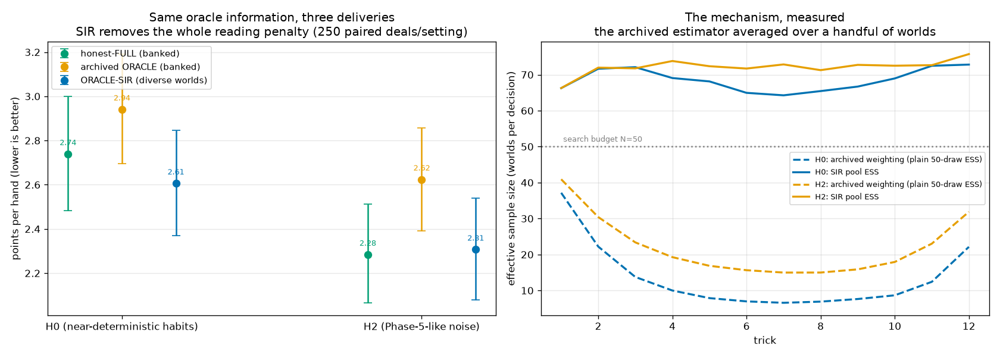
*Left: points per hand at H0 and H2 (95% bootstrap CIs, 250 paired deals per setting) — the archived ORACLE row sits above honest-FULL at both settings; the same likelihood delivered through diverse resampled worlds (ORACLE-SIR) lands on top of honest-FULL. Right: the mechanism, measured per decision — the archived weighting's effective sample size (dashed) craters to ~7–15 of 50 worlds through the middle game, while the SIR pool (solid) stays above the search's 50-world budget.*

### C-bench (2026-08-21) — the first opponent we didn't build ourselves

Five phases measured the bot exclusively against opponents of its own design. C-bench plays the frozen champion (honest-FULL) against OpenSpiel's generic ISMCTS **baseline** — `ISMCTSBot` with UCT c = 2.0, 1,000 simulations per decision, and a single random-rollout evaluator; untrained, untuned, and carrying no Hearts knowledge — the project's first third-party calibration point. The precise claim, stated carefully: this measures the value of **domain knowledge** (an exact constraint-propagated belief table plus a hand-crafted playout heuristic) over a domain-agnostic search baseline at a similar search budget — not superiority over OpenSpiel's strongest Hearts agent. **xinxin**, the academic reference Hearts bot the comparison was designed around, needs a from-source build with an older C++ toolchain (Apple-Silicon success uncertain); the owner deferred that build rather than sink time into it, so the generic ISMCTS bot stood in.

Both directions, 1,000 matched deals, seeds 100000+, no pass / no moon on both sides (`hearts(pass_cards=False, qs_breaks_hearts=False)`):

| direction | ours | ISMCTS | scale |
|---|---|---|---|
| ours-minority (1 of us vs. 3× ISMCTS) | **4.702**, 95% CI (4.557, 4.846) | 7.100 | 1,000 deals |
| ours-majority (3× us vs. 1 ISMCTS) | **5.768**, 95% CI (5.705, 5.832) | 8.697, 95% CI (8.505, 8.885) | 1,000 deals |

Both pre-registered expectations were met verbatim: honest-FULL outscored the ISMCTS baseline in both seatings under identical rules, identical scoring, and identical deals, at comparable per-decision wall-clock (ours 0.146s vs. ISMCTS 0.111s, contended — the baseline actually spent ~24% *less* time; compute was comparable, not exactly equalized, and no simulation-count sweep was run). Two further honesty notes from a post-hoc audit (2026-08-27): the baseline's *internal* planning objective included OpenSpiel's moon-shot rescoring while the games were scored without it — practically negligible (random rollouts essentially never complete a moon; at most 1 deal-row in 2,000 shows a moon-consistent score, bounding the effect at ≤0.03 pts/hand) but real; and a tuned ISMCTS (more simulations, a heuristic rollout policy) would close some unmeasured fraction of the gap. The 2.4–2.9 pts/hand margin is far larger than any of these caveats can explain.

**What this does NOT show.** This match tests strength against a standard third-party bot at comparable cost. It does **not** test the project's headline speed claim (~0.13s/turn for us vs. xinxin's reported ~2.9s/turn), because xinxin was never built here — a gap closed by the Phase 7 xinxin match below.

### The xinxin match (2026-08-29, Phase 7 Task F2) — beating the reference bot on its own protocol

xinxin was subsequently built from source (OpenSpiel `OPEN_SPIEL_BUILD_WITH_XINXIN=ON`, Apple Silicon, Release) and played at its literature settings — 2,000 UCT runs, C=0.4, 50 sampled worlds, single-threaded — the exact configuration the GO-MCTS paper (arXiv 2404.13150) used. Rules alignment: the match is no-pass (natively supported via `pass_cards=False`) and no-moon via xinxin's **own native `kNoShooting` rule**, enabled by a one-line disclosed local patch — a rules configuration, not a strength change, so xinxin optimizes exactly the objective the games are scored by. Both tiers were pre-registered before launch.

**Tier 1 (house protocol, 500 deals × 4 rotations per direction):** we win both directions — paired per-deal diff **−0.81 [−1.10, −0.51]** with one of us against three xinxins, **−0.56 [−0.88, −0.23]** with three of us against one.

**Tier 2 (the field's own protocol: 14-way duplicate seating, 1,000 deals = 14,000 games, Wilcoxon signed-rank):** our seats **6.11 [6.04, 6.18]** vs xinxin's **6.89 [6.82, 6.96]** pts/hand; paired diff **−0.78 [−0.91, −0.64]**; **Wilcoxon z = −11.26** — decisive by both our test and the literature's. Zero legality-tripwire firings across all 18,000 F2 games.

**The speed claim, finally measured third-party:** at match settings on the same machine, ours 0.027 s/decision vs xinxin 0.246–0.256 — **~9× faster while winning**. This measured number replaces the old unverified "~20× vs the published 2.9 s/move" language (xinxin runs far faster on modern hardware than its published figure).

**Scope, honestly:** the GO-MCTS paper's tournament played full Hearts (passing + moon) and beat xinxin by 1.74 pts/hand at 25.6 s/move; our variant is no-pass/no-moon, so the two results are method-comparable but never number-comparable. Within our variant, however, the field's 25-year reference bot is now measured, beaten on strength, and beaten on cost.

**Post-close addendum (2026-08-29, Phase 7 Task A4): the margin is compute-robust against this baseline.** Re-running the ours-minority direction with the ISMCTS baseline's budget raised to 3,000 and then 10,000 simulations per decision (250 identical deals per point, one environment, paired per deal): our score moves 4.70→5.02 (environment-control re-run at 1,000 sims)→5.18→5.19 — a statistically insignificant +0.17 across a **10× budget increase** (CIs straddle zero at both steps) — while the ISMCTS seats stay at ~6.94, *worse than the 6.5 break-even, with three seats against our one*, even while spending **1.24 s/decision, roughly 50× our fused per-decision cost**. The curve is flat: a random-rollout ISMCTS saturates because its leaf evaluator, not its simulation count, is the binding constraint — the same evaluator-binds-not-compute lesson Phase 4's value-net null taught about our own search, now measured on a third-party bot. Scope: this hardens the domain-knowledge claim against the *untuned* baseline specifically; a heuristic-rollout ISMCTS or xinxin would use extra compute far better, and neither is tested by this curve.

**A quieter, honest finding.** ISMCTS turned out to be a materially tougher opponent than anything the project ever built for itself: honest-FULL scores 2.35 pts/hand against Phase 5's synthetic heuristic/personality trios but 4.70 against ISMCTS — a real search bot makes us work harder for our points than our own synthetic gym ever did. Every training and evaluation opponent across five phases was softer than one stock, off-the-shelf bot.

### Exploitability — measuring our own chin

**The design, in two sentences.** The exploiter is our own `HonestSearchPlayer`, except when it imagines the future, the champion's seat is played not by the beginner heuristic but by a reduced-size copy of the champion's *own* search algorithm, nested inside the exploiter's imagination, so a trap only effective against a real searcher can actually be found. The protocol is 1 exploiter against 3 champions rotated through all four seats; the control is the champion attacking itself (four champions must average 6.5 by symmetry, the project's existing mirror alarm), and the exploiter with its model switched off is bitwise-identical to plain honest-FULL, so no strength confound sits between the "ordinary opponent" baseline and the measuring instrument.

**A probe result that reframed the whole design, first.** Asking the champion the same real decisions twice, changing only the dice used to imagine hidden hands, it played a *different* card 30–39% of the time — a near-coin-flip in the opening (agreement ~0.57–0.70) but a near-book (agreement 0.93–0.96) in the endgame, once the hidden cards are nearly pinned down. The champion is not the deterministic book the project's own review had assumed; where a leak could live, and how bookish the attacker's imagination needs to be, both trace back to this.

**Crude attacker** (`results/exploit_eval_A.txt`, 5×2 nested model, one imagined ply, 500 deals):

| row | champion-side pts/hand | 95% CI |
|---|---|---|
| exploitability (R1 − R0) | **+0.079** | [−0.014, +0.172] |

The point estimate sits inside the ROBUST band (<0.1), but the CI spans robust through minor-leak and includes zero: cannot certify robust, cannot claim a leak. **The single-victim variant** (`results/exploit_eval_B.txt`, one champion + two heuristics + the exploiter, 250 deals) came back null — **−0.015, CI [−0.283, +0.251]** — and the exploiter seat itself scored *worse* than a plain champion would have in that seat (+0.155 exploiter-side): the same inversion 6A found. A model of the opponent narrowed the exploiter's own imagination and cost it points rather than helping.

**Strengthened student** (`results/exploit_eval_R1v.txt`, owner-approved escalation: 20×5 nested model, 2 imagined plies, VOIDS-level nested posterior for speed). First, did the bigger model actually imitate the champion better? Fidelity rose from 0.596 to 0.682 against a 0.727 ceiling (the champion's own agreement with itself under a different seed) — closing 66% of the gap:

| tricks | 5×2 (crude) | 20×5 (strengthened) | ceiling |
|---|---|---|---|
| all | 0.596 | 0.682 | 0.727 |
| 1–4 | 0.370 | 0.464 | 0.587 |
| 5–9 | 0.575 | 0.695 | 0.695 |
| 10–13 | 0.925 | 0.943 | 0.962 |

With the stronger student running (250 deals, seeds 100000–100249):

| row | champion-side pts/hand | 95% CI |
|---|---|---|
| exploitability (R1v − R0) | **+0.1977** | [+0.0683, +0.3273] |

**The project's first significant exploitability result** — the crude attacker's CI had included zero; this one doesn't. **Verdict per the pre-registered bars: MINOR LEAK (0.1–0.3)** — documented; hardening is **not** triggered (that requires >0.3).

**Where the edge lives.** The trade is the same shape as the crude attacker's, amplified: the strengthened exploiter takes fewer points in the endgame than a plain champion would (its tricks-10-13 haul is 2.18 vs. the baseline champion's 3.02), while champions attacked by it bleed more there (3.26). The queen moves the exploiter's way too (2.94 for the exploiter vs. 3.41 for the baseline champion). The nested model's next-card prediction hit-rate against the real champion is only **0.293** — the exploiter doesn't need to call individual cards correctly; getting the endgame *tendency* right is enough.

**Honest caveats, stated up front.** Every stronger student found more (+0.079 crude → +0.198 strengthened), so +0.198 is a **lower bound** — a full-size nested model, or eventually a genuinely learned attacker, likely finds more still. 250 deals resolves ROBUST-vs-REAL-LEAK but not the edges of the 0.1–0.3 band itself; the CI brushes both 0.068 and 0.327. And the attacker remains a search best-response, not a learned RL attacker — route (b) from the C0 design (an OpenSpiel-wrapped learned attacker) was never triggered, because a leak this size doesn't clear the bar the plan set for escalating.

**Exploitability is now a standing regression test**, re-run after every future bot change (`run_exploit_eval.py --rows R0,R1v --fast`), not a one-off measurement.

### Infrastructure findings worth recording

- **Fused decision kernel (Phase 2.8).** The whole candidate × world loop, including honest search's inner re-determinization, now runs inside one compiled call instead of many Python-mediated ones, using pre-drawn RNG seeds so the fused path stays bitwise-identical to the unfused one (718 decisions checked exactly, plus a 311-decision hostile corpus built specifically to force every fallback branch). **5.3×** on a single seat (147 → 28 ms/decision), 5.2× across four. Default off; opt-in per experiment.
- **Equivalence-class card grouping.** Cards that are provably interchangeable (e.g. the lowest two clubs, when nothing live sits between them and neither is the Q♠) are proven — by a theorem checked against a matched-seed control, 268 decisions and 881 classes — to score identically, so they're evaluated once instead of twice. The diagnostic this surfaced is worth keeping on its own: on the *ungrouped* path, the search's own imagined score for two mathematically identical cards differs by a mean of **0.455 points**, and is exactly zero in only 44.9% of cases — a direct measurement of how much of the project's "39% self-disagreement" number (the C0 probe above) is pure sampling noise on cards the bot cannot actually tell apart. Grouping is theorem-safe but consumes a different sequence of rng draws, so it is **not bitwise-compatible with the banked exploitability rows** and was kept **OFF** for the exploit run — it becomes its own bot version, to be measured properly in Phase 7.
- **Batched nested model.** Compiling the exploiter's several hundred miniature-champion calls per decision into one kernel call bought **1.29×** on the full R1 row (1.38× on the exploiter seat alone) — well short of the 5–10× the roadmap projected. The honest reason: the roadmap assumed Python glue dominated the cost; profiling showed it was only ~0.16ms of ~0.58ms per nested call, with the rest being compiled belief-rebalance work that batching cannot touch. Stacked with kernel fusion, the combined, measured speedup on the exploit row is **4.36×** (13.11 → 3.01 s/game) — enough to turn a multi-hour exploitability run into a 20-minute one, which is what makes the new standing regression test affordable to actually run after every change.
- **A negative portability result.** Every bitwise-reproducibility claim elsewhere in this README (JIT-on vs. `OPENHEARTS_NO_JIT=1`, fused vs. unfused kernels, grouped vs. matched-seed ungrouped) has so far been checked on one machine, an Apple Silicon Mac. A GitHub Actions CI probe testing the same guarantee on x86 runners found it does **not** travel: on an Intel Xeon 6973P-C runner, the project's own bitwise tripwire test (`test_fused_audit.py::test_posterior_is_identical_through_the_factory`, which compares a fused belief posterior's probabilities byte-for-byte against the unfused reference) **failed** — several probability values differed by a few ULPs in their low mantissa bits. The identical suite passed cleanly on a *different* GitHub-hosted runner, an AMD EPYC 7763 (290 passed, 10 skipped). **Bitwise reproducibility is architecture-specific, not just a JIT-on/off question** — results differed even between two of GitHub's own machines, let alone between GitHub and the project's own Mac. Cross-platform runs are invalid under this project's bitwise standard; every gate in this README should be read as "bitwise on the machine it was measured on," not as a universal guarantee.

## Known limitations

Stated plainly, not hidden:

1. **Sampling bias.** The sampler assigns cards to opponents one at a time, weighted by the belief table's per-card probabilities. This is close to, but not exactly, sampling whole hidden-hand arrangements uniformly at random from everything consistent with the constraints. In practice it's close enough to be useful, but it is a real, acknowledged approximation.
2. **Playout opponents can effectively see everything (Phase 1 search; largely addressed by Phase 2's honest search, see above).** Inside one imagined arrangement, the playout code plays out a fully-specified game — which means the heuristic "opponents" in that imagined playout are reacting to a fully known hand, not the same partial information a real opponent would have. Honest search re-determinizes one level deep, which is why belief quality now shows up in points, but it is not a full fix (see limitation 7 below).
3. **The playout policy is a mirror.** Playouts use the exact same heuristic that the actual opponents use. That's a perfectly accurate opponent model by construction, which flatters the results — a real opponent might play very differently from the heuristic, and search tuned against a perfect mirror of its opponents won't necessarily transfer. Phase 3's choice-evidence machinery has this same dependency in a sharper form: see limitation 8.
4. **Passing and shooting the moon are out of scope.** The 3-card pass before play starts isn't modeled, and shooting the moon (taking all 26 points to flip the score) is ignored entirely — scoring always assumes the normal 26-points-split rule. The 6.5-point break-even control depends on both of these choices; a game with passing and moon-shooting could look different.
5. **Guessing curves are heuristic-specific.** The guessing accuracy numbers above (0.588 mean probability, 0.60 top-1 at trick 13 for FULL; 0.899 / 0.90 for CHOICE) were measured on games where every seat plays the same heuristic strategy. A different mix of opponents would produce different play patterns and could shift these numbers up or down.
6. **The rebalancing tolerance is a known approximation.** FULL-level rebalancing (iterative proportional fitting) accepts a 1e-4 numerical tolerance in cases where the constraints force some entries to the boundary (exactly 0). We verified this stays within about 0.003 of exact enumeration on the cases we checked, which is small, but the principled fix — detecting forced placements directly instead of approaching them iteratively — wasn't built this phase.
7. **Honest search is one rung below full information-set search.** One-level re-determinization re-samples once per imagined path, at the next decision point. A full fix would re-sample at every single decision inside every imagined playout (closer to true information-set MCTS), which would likely earn more of the sensitivity honest search unlocked but was out of scope for this phase on cost grounds.
8. **Choice evidence assumes a known opponent policy.** `WeightedPosterior` in strict mode (epsilon=0) is only exactly correct when the real opponents play exactly the modeled deterministic heuristic. Against opponents who deviate even slightly, strict filtering doesn't just weaken gracefully — the robustness experiment above shows it collapses hard (96% of decisions by trick 13) and can end up worse than not reading choices at all. The epsilon knob quantifies the cost of a wrong model and gives a way to hedge against it, but epsilon itself has to be guessed at or measured in advance — there's no mechanism here for learning it online.
9. **Soft-mode weight degeneracy.** CHOICE-soft (epsilon>0) computes each world's weight as a product of many small per-decision factors, so even when 100 worlds nominally survive, the *effective* number carrying most of the weight can be as low as roughly 1–6 (`mean_n_effective` in robustness.txt) — a handful of arrangements can end up dominating the posterior even though many are technically alive. Soft mode is still far more robust than strict, but its stated 100-world budget partly overstates how much genuine diversity is being sampled from.
10. **Trained and evaluated entirely inside the heuristic-opponent world.** Both the self-play data and the ablation opponents are the same deterministic `HeuristicPlayer`/`RandomizedHeuristic` this project has used since Phase 1. The proven null above is scoped to that world; it says nothing about a value net's prospects against real, less-mechanical opposition (Phase 5's hook).
11. **Supervised-on-outcomes is the simplest possible learning signal.** Task 3 used raw future points as labels; Task 6.5 showed that even removing all label noise (distilling the playout directly) didn't change the verdict, which rules out label design as the fix here — but neither approach explored anything beyond direct regression (no policy-gradient/Q-learning machinery, per the phase's explicit scope).
12. **Equal-compute comparisons are wall-clock on this machine (M5 Max).** The equal-time row's n_outer/n_inner scaling was calibrated to match the bridge row's measured s/game on this hardware; a different machine's CPU/MPS balance could shift the exact scaling factor, though the underlying finding (evaluator quality binds, not world count) is not expected to depend on that calibration.
13. **The featurizer is a fixed, hand-chosen representation.** NF=333 marginal features (per-card presence, per-seat, plus scalars) were the v1 spec and were never revisited after the null; a richer representation encoding card *interactions* directly (e.g. suit-void patterns across seats) was flagged as a plausible fix for the forced-sequence blind spot but was out of scope this phase.
14. **Population realism is now the phase's single biggest assumption.** The 12-axis personality family plus a per-decision noise floor is a real, checked-for-divergence population, but it is not moods, not mid-match adaptation on the *opponents'* side, and not multi-trick planning — three things a real human brings that this population does not simulate. Every play-strength and guessing number in this phase is scoped to synthetic opponents built this way; the standing owner caveat (limitation (b) above) is that this may make reading look weaker here than it would against real people, not stronger.
15. **Match-blocked adaptation is scoped to within-block continuity.** `SeatMixture`'s "getting to know you" effect only accumulates evidence within one fixed-trio block (25 deals here); it resets on reseating and was never tested against opponents who change strategy mid-match (a "style-shifting player," floated as a contingency population enrichment in the plan but never built, since Task 4/6 evidence didn't call for it).
16. **House rules stay in force.** As in Phases 1–4, no passing and no moon-shooting; every number in this section assumes the 26-point normal split. This was a standing design decision for any real play this phase might have collected data from (the relay, deferred), and it keeps every Phase 1–5 result directly comparable.
17. **Reading is retired on synthetic evidence only — and the measured penalty is now known to be an estimator artifact.** The Phase 6A entropy curve found reading hurts at every habit-strength setting the project could build (H0–H3, entropy 0.70–1.30 nats), including a near-deterministic H0. But H0 is still a synthetic personality with a per-decision noise floor as low as 0.5% and three hand-designed contextual axes — not a real person. The 6B human relay (spec'd for exactly this test, but not yet built) produced no games this phase; the decision to retire reading was made entirely on synthetic grounds, and the plan's own standing caveat is that it could reverse once real human logs exist. *Post-close (Phase 7 Task A1, 2026-08-28): the "hurts" half of this verdict was traced to likelihood-weight degeneracy — a non-degenerate resampling estimator removes the penalty entirely at both settings retested (see the 6A addendum above). The scoped claim is now "reading, delivered through a sound estimator, costs nothing and gains nothing measurable vs constraint counting on these populations" — retirement from the shipped bot stands, but as a no-edge result, not a harm result.*
18. **C-bench did not test the project's speed claim** — resolved in Phase 7 (Task F2): xinxin was built and beaten on both our protocol and the literature's (paired diff −0.78 [−0.91, −0.64], Wilcoxon z=−11.26, 14,000 games), and the speed comparison was finally measured same-machine: **~9× faster per decision**, which retires the old unverified "~20×" figure (xinxin runs much faster on modern hardware than its published 2.9 s/move). Remaining scope limit: the match is on the no-pass/no-moon variant — full-Hearts numbers (the GO-MCTS paper's setting) remain not comparable.
19. **Exploitability is a lower bound from a depth-limited, non-learned attacker.** The exploiter nests only the first one or two imagined decisions of a reduced-size copy of the champion (20×5 at best, vs. the champion's own 50×20), reaching only 68% overall agreement with the real champion's choices. Every strengthening tried so far found a bigger leak, not a smaller one (+0.079 → +0.198 champion-side); a full-size nested model or a genuinely learned attacker (the OpenSpiel-adapter route the design pre-registered but never triggered) would plausibly find more. "Minor leak, hardening not triggered" describes what this instrument found, not a ceiling on what a better instrument could find.
20. **No mixed-strategy hardening was built.** The measured leak (0.1–0.3 champion-side) sits below the >0.3 bar the plan set for triggering a hardening experiment, so none was attempted — the bot still plays the same deterministic-given-beliefs policy it always has, protected only by the accidental Monte-Carlo noise in its own search (itself partly explained now by equivalence-class grouping's diagnostic, and itself something a future optimization like stratified sampling could reduce — exactly why the leak is watched as a standing regression rather than closed as a settled fact).
21. **Bitwise reproducibility is architecture-specific.** Every deterministic-path guarantee elsewhere in this README was measured on one Apple Silicon Mac. A GitHub Actions probe found the identical guarantee fails on at least one x86 runner (differing by a few ULPs) while passing cleanly on another — so none of this project's bitwise claims should be read as portable across hardware without re-verification on the target machine.
22. **The human-data clock has not started.** 6B (the terminal relay for logging real games) was specified but its build was deferred to background work, and the owner's live-session gate for 6C was waived rather than met — Phase 6's entropy-curve and exploitability results are both measured entirely on synthetic self-play. The project's headline goal, beating real human players, remains untested end to end.
