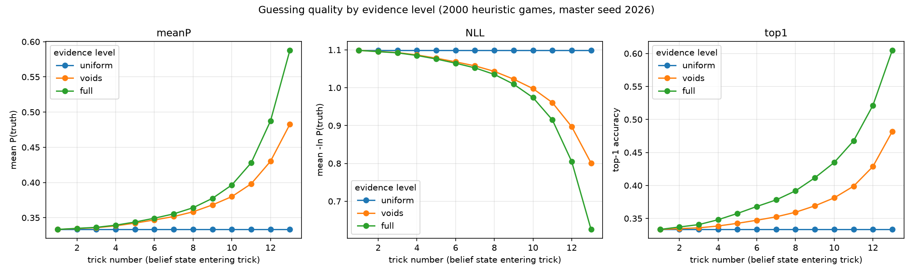
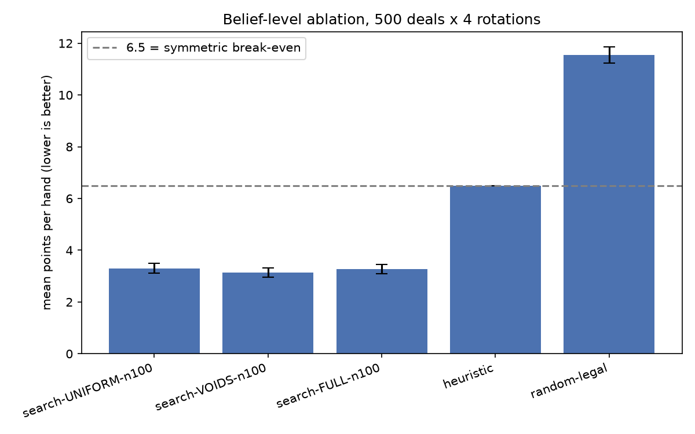
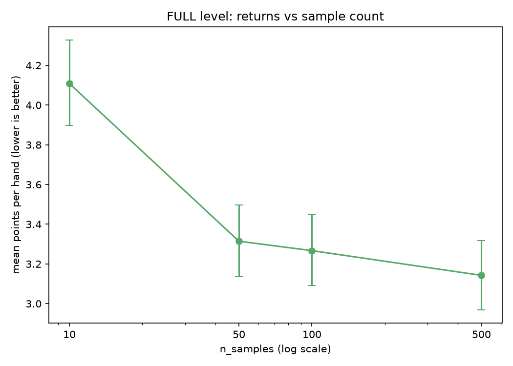

# open-hearts

A small project that plays the card game Hearts and tries to do two things honestly:

1. **Guess where the hidden cards are**, using only what a player would legitimately know (their own hand, and what's been played).
2. **Use those guesses to pick better moves**, by imagining a few likely arrangements of the hidden cards, playing each one out, and picking the move that scores best on average.

The whole point of this project is measuring whether step 2 actually works, and reporting the answer plainly even where it's underwhelming.

## The one-idea summary

In Hearts, once a player fails to follow suit (say, someone can't follow a club lead), you learn something exact: that player has **zero** clubs. That single fact doesn't just remove clubs from them — because everyone's hand size is fixed, all the probability that clubs *would* have taken up in their hand has to move somewhere else. We keep a running table of "how likely is each opponent to hold each card," update it every time a void is revealed, sample a few concrete hidden-hand guesses from that table, play each one out to the end with simple heuristic players, and choose the move that gives the lowest average points across those playouts.

## How the belief table works

The table is 3 opponents x 52 cards, holding P(opponent i has card c). Two constraints always hold:

- A card the observer can see (in their own hand, or already played) has probability 0 for every opponent.
- Each opponent's row must sum to the number of cards they're still holding.

**A worked example.** You are the observer, and the trigger is a player failing to follow suit. Concretely:

- West leads a heart. North discards a club instead of following. That's a **void reveal**: North has zero hearts.
- Before this: hearts were spread roughly evenly across North, East, and South's remaining hearts (since your own hand and played cards are zeroed out already).
- After this reveal: North's probability on every heart card drops to exactly 0. All of the probability mass that used to sit on "North holds this heart" has to go somewhere, because East and South must still collectively hold every remaining heart. So East's and South's probabilities on those hearts rise.
- But North still holds the same number of cards as before (nothing about her hand *size* changed) — so her probability on her *non-heart* cards has to rise too, to make her row sum back up to her hand size. She still has just as many cards, but now we know none of them are hearts, so the "missing" heart-probability she used to carry gets redistributed onto the clubs, diamonds, and spades she might hold.

This rebalancing — start from raw void/seen-card zeroing, then adjust rows and columns until both constraints (zeroed cells stay zero, each row sums to hand size) hold together — is implemented with iterative proportional fitting in `src/openhearts/belief/table.py`. It is exact for the constraints it's given: it correctly describes what opponents *could* be holding given voids and hand sizes. It says nothing about *how* opponents choose which card to play, which is a real limitation (see below).

There are three levels of belief, compared throughout this README:

- **UNIFORM** — ignore all evidence beyond "cards you can see are zero." Every unseen card equally likely for everyone.
- **VOIDS** — also use void reveals (the mechanism above), rebalanced.
- **FULL** — the full rebalanced table (voids plus proper row/column consistency).

## How to run

```bash
python -m venv .venv
source .venv/bin/activate
pip install -e '.[dev]'
```

Run the fast test suite:

```bash
.venv/bin/python -m pytest -q
```

Run the slow fuzz tests (randomized, more thorough, take longer):

```bash
.venv/bin/python -m pytest -m slow -q
```

Run the experiments (results land in `results/`, which is gitignored — regenerate them rather than expecting them to be checked in):

```bash
python experiments/run_guessing.py          # Question A: are the guesses any good?
python experiments/run_ablation.py          # Question B: do better guesses win more points? (single core)
python experiments/run_ablation_parallel.py # same, but spread across multiple cores
python experiments/run_noleak.py            # corrected control, see "sampler void leak" below
python experiments/run_sampler_stats.py     # how hard the sampler has to work
```

## Headline result 1: can we guess where the cards are?



We compare three belief levels against the true deal (which only the measurement code is allowed to see — the belief code never touches it). By trick 13 (the last trick, when there's the least uncertainty left):

| level   | mean probability on true holder | top-1 accuracy |
|---------|----------------------------------|-----------------|
| FULL    | 0.588                             | 0.60 |
| VOIDS   | 0.483                             | 0.48 |
| UNIFORM | 0.333                             | 0.33 |

At every trick from 1 to 13, FULL >= VOIDS >= UNIFORM. More evidence never hurts, and using void information clearly helps over doing nothing.

**Where we were wrong going in:** the plan guessed FULL would climb close to 1.0 by the last few tricks, since so few cards remain unseen. It doesn't — it plateaus around 0.59. We checked this against exact enumeration of all consistent hands, and 0.59 genuinely is the ceiling for this kind of evidence: in the last few tricks, the cards left in an opponent's hand are frequently *actually interchangeable* given only voids and hand-size constraints — there's no more information to extract from "what suits has this player failed to follow" alone. That ceiling is specific to this evidence class, though: real opponents aren't choosing cards uniformly at random from what's legal, they're playing according to some strategy, and inferring from *how* they play (not just what they're void in) could in principle push accuracy higher. We didn't build that — it's out of scope for this phase — so we can't say how much higher, only that the room for it exists.

## Headline result 2: do better guesses win more points?




Setup: 500 deals, each played with the bot rotated through all 4 seats (2,000 games total), against 3 heuristic opponents. 26 points are dealt per hand, so 6.5 is the break-even point; scoring below 6.5 means beating heuristic opponents.

| config                     | mean  | 95% CI          |
|----------------------------|-------|-----------------|
| search-UNIFORM-n100        | 3.302 | [3.120, 3.485]  |
| search-VOIDS-n100          | 3.139 | [2.964, 3.314]  |
| search-FULL-n100           | 3.267 | [3.091, 3.447]  |
| heuristic (no search)      | 6.500 | (fixed)         |
| random-legal               | 11.548| [11.235, 11.859]|
| search-UNIFORM-noleak-n100 (corrected control) | 3.371 | [3.191, 3.554] |

**The honest reading:**

- Search helps, a lot. Any belief level with sampled-playout search (~3.2–3.4 points/hand) roughly halves the heuristic's score (6.5 points/hand), and the confidence intervals don't overlap. Just *searching* over sampled futures, even with a weak belief model, is clearly worth doing.
- The three belief levels **do not separate statistically** from each other. VOIDS is nominally lowest (3.139) and FULL is nominally worse than VOIDS (3.267), but their confidence intervals overlap heavily with UNIFORM's — we cannot say any belief level beats the others at n=100 samples.
- That's suspicious on its own, though, because even "UNIFORM" here was quietly getting some void information for free: the sampler (`src/openhearts/sampler/sampler.py`) refuses to deal a card into a suit an opponent is known to be void in, *at every belief level*, including UNIFORM. So "UNIFORM" wasn't really evidence-free. We built a corrected control (`search-UNIFORM-noleak-n100`, `sampler_respects_voids=False`) that truly ignores voids when sampling. It scored 3.371 — worse than the leaky UNIFORM (3.302) and worse than VOIDS/FULL, as expected — but its confidence interval still overlaps VOIDS and FULL, so even this doesn't establish a clean separation.
- **Conclusion, stated plainly:** with determinized search at 100 samples, belief sharpness beyond basic void-consistency is worth at most about 0.2 points per hand against opponents of this strength. That's a small, real effect that we can't confidently distinguish from noise at this sample size — not a negative result to hide, but exactly the kind of "it didn't move the needle much" finding the project asked to be reported rather than tuned away.

**Sample-count sweep** (FULL level, same 500 deals): 10 samples per decision is too few (mean 4.109 — noticeably worse); 50 samples captures most of the achievable value (3.314); going from 100 to 500 samples buys only about 0.12 more points (3.267 -> 3.143) for roughly 5x the compute. n=100 is the sweet spot used throughout.

## Sampler cost

We measured the plain restart-based sampler (`src/openhearts/sampler/sampler.py`: walk the unseen cards, assign each to an opponent by weighted draw, restart on a dead end) before considering any optimization, per the project's "measure before optimizing" rule. It never needed one: 0.0% failure rate at every trick, and even its worst case (trick 10, the most constrained point in the hand) needed on average only 1.15 attempts to find a valid arrangement. None of the sampler improvements sketched in planning were ever built, because the numbers said they weren't needed.

## Known limitations

Stated plainly, not hidden:

1. **Sampling bias.** The sampler assigns cards to opponents one at a time, weighted by the belief table's per-card probabilities. This is close to, but not exactly, sampling whole hidden-hand arrangements uniformly at random from everything consistent with the constraints. In practice it's close enough to be useful, but it is a real, acknowledged approximation.
2. **Playout opponents can effectively see everything.** Inside one imagined arrangement, the playout code plays out a fully-specified game — which means the heuristic "opponents" in that imagined playout are reacting to a fully known hand, not the same partial information a real opponent would have. This makes the search over-trust its own guesses about what opponents will do, and it likely undervalues moves whose main benefit is creating uncertainty for real opponents (since imagined opponents in a playout aren't actually uncertain about anything). This is probably a real contributor to why the belief levels didn't separate in the ablation above — a smarter belief table can't help much if the model of what happens next doesn't reward the extra sharpness.
3. **The playout policy is a mirror.** Playouts use the exact same heuristic that the actual opponents use. That's a perfectly accurate opponent model by construction, which flatters the results — a real opponent might play very differently from the heuristic, and search tuned against a perfect mirror of its opponents won't necessarily transfer.
4. **Passing and shooting the moon are out of scope.** The 3-card pass before play starts isn't modeled, and shooting the moon (taking all 26 points to flip the score) is ignored entirely — scoring always assumes the normal 26-points-split rule. The 6.5-point break-even control depends on both of these choices; a game with passing and moon-shooting could look different.
5. **Guessing curves are heuristic-specific.** The guessing accuracy numbers above (0.588 mean probability, 0.60 top-1 at trick 13) were measured on games where every seat plays the same heuristic strategy. A different mix of opponents would produce different play patterns and could shift these numbers up or down.
6. **The rebalancing tolerance is a known approximation.** FULL-level rebalancing (iterative proportional fitting) accepts a 1e-4 numerical tolerance in cases where the constraints force some entries to the boundary (exactly 0). We verified this stays within about 0.003 of exact enumeration on the cases we checked, which is small, but the principled fix — detecting forced placements directly instead of approaching them iteratively — wasn't built this phase.
